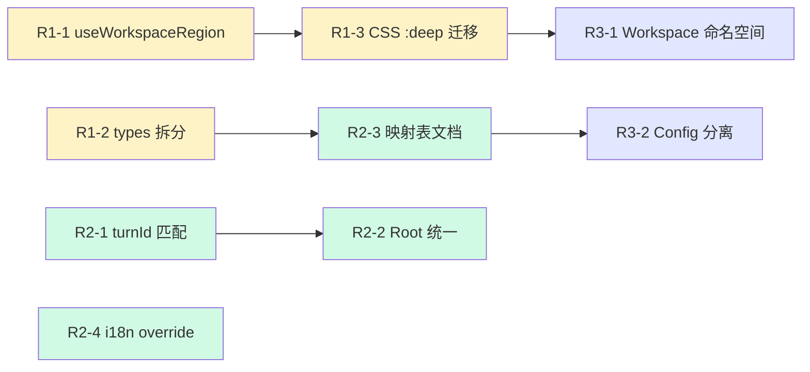

# TinyRobot Chat Kit Review 03

> 面向 `packages/chat` 的第三轮深度评审与重构分析  
> 基于 review-01（已落地结论）和 review-02（执行规范）之后的最新代码全量审读  
> 审读时间：2026-03-21  
> 文档状态：讨论稿，待确认后纳入执行计划

---

## 0. 评审背景

### 0.1 已完成的阶段

| 阶段 | 状态 | 用一句话概括 |
|:-----|:-----|:------------|
| review-01 P0/P1/P2 | ✅ 已落地 | Root+Layout 分离、MCP 单实例、模型切换单 owner、乐观更新、状态分片等核心问题已修复 |
| review-02 P0-P3 | ✅ 已完成 | 配置链路 `ChatConfig -> Adapter -> Preset`、Feature Registry、CLI 消费契约已建立 |
| review-02 P4 | ⏸ P4-A 完成、P4-B 暂停 | AgentPreset + SkillPack 组合层已建立，暂停于白盒 preset 入口 |
| review-02 P5 | 🔄 进行中 | P5-A (外观) 最小收口、P5-B (WorkspaceShell) 运行时完成、P5-C (内容导航) 首轮实现完成 |

### 0.2 本轮评审目标

1. 基于当前最新源码，**重新审视架构健康度**——重点关注经过多轮迭代后是否出现新的技术债务
2. 对标 **Vercel AI SDK 5.x**、**Ant Design X**、**LobeHub** 等业界最新实践，找到下一步优化方向
3. 识别 **代码质量、可维护性、可扩展性** 的具体改进点，为下阶段执行提供决策依据
4. 不重复 review-01/02 已经覆盖的内容，聚焦 **新发现** 和 **深层问题**

### 0.3 补充校验说明（2026-03-21 二次修订）

在本文初稿基础上，又对以下内容做了二次校验：

1. 对照当前工作区源码，修正了部分**文件行数统计**与**现状描述**
2. 对照 Vercel AI SDK 5 / Ant Design X 官方文档，修正了少量**业界对标表述**
3. 补充了关于 `packages/chat` **目录是否需要重排** 与 **`@` 别名是否值得引入** 的结论

> 说明：本修订稿中，凡是带有“补充修正”字样的内容，均基于 2026-03-21 当天源码与文档再次核对后的结论。

---

## 1. 业界最新实践对标（2026 Q1）

### 1.1 Vercel AI SDK 5.x 的最新架构演进

Vercel AI SDK 在 5.x 版本中进行了重大架构升级，其核心设计对 TinyRobot Chat Kit 有重要参考价值：

#### Transport 抽象层

```typescript
// Vercel AI SDK 5.x 的核心创新点
const { sendMessage, messages, status, stop } = useChat({
  transport: new DefaultChatTransport({ api: '/api/chat' }),
})
```

**关键设计决策：**

| 设计点 | Vercel AI SDK 5.x | TinyRobot Chat Kit | 差距与建议 |
|:-------|:------------------|:-------------------|:----------|
| Provider 抽象 | `Transport` 层——统一包装 API 调用、序列化、反序列化 | `ResponseProvider` 函数签名——只约束输入输出类型 | TinyRobot 的 `ResponseProvider` 更轻量，但缺少中间件/拦截器扩展点 |
| 状态管理 | `status: 'submitted' \| 'streaming' \| 'ready' \| 'error'` | `status: 'ready' \| 'submitted' \| 'streaming' \| 'error'` | 两者都具备独立 `error` 状态；TinyRobot 在错误归类上更进一步，Vercel 则将更多细节附着在 `message.parts` / metadata 上 |
| 共享上下文 | 支持 `Chat` 实例 + `useChat({ chat })` 共享 | `useChatKit()` → `provide/inject` | TinyRobot 的 Vue provide/inject 模式本身合理，但缺少“外部先创建实例，再注入”的显式生命周期入口 |
| 消息模型 | `UIMessage` with `parts` (text / tool-invocation / tool-result / file / reasoning / source) | `ChatMessage` with `content` (string) + `toolCalls` + `state` | Vercel 的 `parts` 模型更适合多模态，TinyRobot 的消息模型相对扁平 |
| 持久化 | 官方文档提供 `UIMessage[]` 持久化模式（应用层 `saveChat/loadChat`） | 通过 `storage` 策略传入 | 两者都支持；Vercel 偏“文档约定 + 应用层实现”，TinyRobot 偏“显式 storage 策略注入” |

#### 对 TinyRobot 的启示

1. **Transport/中间件层**：当前 `ResponseProvider` 是纯函数签名，无法在调用前后注入跨切面逻辑（如 logging、rate limiting、token counting）。建议后续考虑在 `ResponseProvider` 之上增加可选的中间件/拦截器层
2. **Chat 实例的显式生命周期**：Vercel 官方明确支持传入现成的 `chat` 实例给 `useChat`。TinyRobot 的 `useChatKit()` 当前在 composable 内部耦合了实例创建，重建通常需要 unmount/remount 组件
3. **消息 Parts 模型**：当前 `ChatMessage.content` 是 string，多模态内容（文件、工具调用结果、推理过程）需要扩展到 content 之外的字段。长期来看考虑 parts-like 模型有价值

### 1.2 Ant Design X 的组件设计模式

Ant Design X（`@ant-design/x`）代表了国内 Chat UI 组件库的标杆：

| 设计点 | Ant Design X | TinyRobot Chat Kit | 评估 |
|:-------|:-------------|:-------------------|:-----|
| 组件粒度 | 原子级：`Bubble` / `Bubble.List` / `Sender` / `Prompts` / `ThoughtChain` | 套件级：`TrChat.*` compound 组件 | TinyRobot 的套件模式适合"快速搭建完整 Chat"，但丧失部分原子级复用灵活性 |
| Bubble 定制 | `Bubble.List` 直接接 `roles` + `items`，variant 通过 `avatar/header/footer` slot | `BubbleProvider` matcher 机制 + `roleConfigs` | TinyRobot 的 matcher 更适合复杂场景（如按 content type 匹配），但学习曲线更高 |
| 流式渲染 | 内置 `typing` 属性 + `contentRender` | 通过 `MarkStreamRenderer` 渲染器 | 都能工作，但 TinyRobot 的渲染器注册制更灵活 |
| 思考链/推理 | `ThoughtChain` 独立组件 | 无独立组件，通过 `toolCall` renderer 覆盖 | 随着 o1/R1 等推理模型的普及，这是一个值得新增的能力 |
| 会话管理 | `Conversations` 组件 + `useXAgent` hook | `useChatKit` + `TrChat.History` | TinyRobot 的实现更集成，但 Ant Design X 的解耦更彻底 |

### 1.3 LobeHub 最新实践回顾

LobeHub 在过去一年的迭代中进一步强化了其状态管理和可扩展性：

| 维度 | LobeHub 当前 | TinyRobot 当前 | 对比变化 |
|:-----|:------------|:--------------|:---------|
| 状态分片 | 多 Zustand slices (agent/session/chat/topic/plugin) | `useChatKit` → `useChatConversation` + `useChatMessages` + `useChatRequest` | **TinyRobot 本轮已采纳分片思路** ✅，但粒度仍偏粗 |
| 插件系统 | 成熟的 plugin store + market | `useMcpManager` + bridge 模式 | TinyRobot 的 bridge 模式已是合理抽象 ✅ |
| 乐观更新 | 核心特性 | `optimisticTurn` 机制已实现 | **TinyRobot 已实现** ✅ |
| 多模态 | 图片/文件/TTS/STT 全面支持 | `attachments` + `voice` 已基础支持 | 基础形态已有，但深度不足 |

---

## 2. 当前架构健康度评估

### 2.1 架构分层现状

```text
┌─────────────────────────────────────────────┐
│  Application Layer                          │
│  ┌───────────┐  ┌────────────┐              │
│  │ TrChat    │  │ WorkShell  │  (黑盒/白盒) │
│  │ (Compound)│  │ (Workspace)│              │
│  └─────┬─────┘  └─────┬──────┘              │
│        │               │                    │
│  ┌─────┴───────────────┴──────┐             │
│  │  Preset / Adapter Layer    │             │
│  │  createPresetChatProps()   │             │
│  │  createPresetChatSlices()  │             │
│  │  resolveAgentPreset()      │             │
│  └─────────────┬──────────────┘             │
│                │                            │
│  ┌─────────────┴──────────────┐             │
│  │  Feature Registry Layer    │             │
│  │  resolveChatFeatures()     │             │
│  │  CHAT_FEATURE_REGISTRY     │             │
│  └─────────────┬──────────────┘             │
│                │                            │
│  ┌─────────────┴──────────────┐             │
│  │  Composable Layer          │             │
│  │  useChatKit / useChatConv  │             │
│  │  useChatMessages / Request │             │
│  │  useMcpManager / Model…    │             │
│  └─────────────┬──────────────┘             │
│                │                            │
│  ┌─────────────┴──────────────┐             │
│  │  Kit Layer (tiny-robot-kit)│(外部依赖)   │
│  │  useConversation           │             │
│  │  useMessage                │             │
│  └────────────────────────────┘             │
└─────────────────────────────────────────────┘
```

**总体评价：架构分层清晰度 8/10**

- ✅ Feature Registry → Adapter → Preset 链路已成型
- ✅ composable 分片基本合理
- ✅ 黑盒/白盒共享同一底座
- ⚠️ WorkspaceShell 与 Chat 的组合关系仍偏 demo-driven
- ⚠️ 部分 composable 的职责边界有模糊地带

### 2.2 当前最突出的关注点

经过对最新代码的全量审读，以下是按影响程度排序的关注点清单：

#### 🔴 C1：WorkspaceShell.vue 已膨胀到 690 行——亟需拆分

**位置**：[WorkspaceShell.vue](./src/components/workspace/WorkspaceShell.vue)

**现状**：
- `<script setup>` 部分 225 行，包含 12 个 `watch`、6 个计算属性、6 个更新函数
- `<template>` 部分 142 行，包含 6 个具名 slot
- `<style scoped>` 部分约 320 行
- 左右区域的逻辑完全对称但全部手工复制

**问题分析**：

```
左区域逻辑                  右区域逻辑
─────────────              ─────────────
uncontrolledLeftCollapsed   uncontrolledRightCollapsed
leftCollapsedState          rightCollapsedState
updateLeftCollapsed         updateRightCollapsed
toggleLeftRegion            toggleRightRegion
isLeftCollapsible           isRightCollapsible
isLeftHiddenMode            isRightHiddenMode
leftPanels                  rightPanels
leftPanelItems              rightPanelItems
leftActivePanelIdState      rightActivePanelIdState
updateLeftActivePanelId     updateRightActivePanelId
```

这种 left/right 的完全对称复制显著降低了可维护性。任何区域行为变更都需要同步修改两套几乎相同的代码。

**业界对比**：
- VS Code 的 sidebar：通过 `ViewContainer` + `ViewRegistry` 抽象，左右侧面板共用同一套区域机制
- Ant Design 的 ProLayout：`Sider` 组件实例化 → 传入 `placement`，不做左右逻辑复制

**建议方案**：

提取 `useWorkspaceRegion(regionKey, config, emit)` composable：
```typescript
// composables/useWorkspaceRegion.ts
export function useWorkspaceRegion(
  regionKey: 'left' | 'right',
  regionConfig: () => ChatWorkspaceRegionConfig | undefined,
  controlledCollapsed: () => boolean | undefined,
  emit: { 
    updateCollapsed: (v: boolean) => void
    updateActivePanelId: (v: string) => void
    onToggle: (v: boolean) => void
    onPanelChange: (p: ChatWorkspacePanelDefinition | undefined) => void
  }
)
```

这可以将 script 逻辑从 ~225 行减少到 ~60 行，同时消除 left/right 的重复代码。

> [!IMPORTANT]
> 这不仅是代码风格问题，而是影响后续 WorkspaceShell API 演进的结构性问题。每次新增 region 行为（如 resize、persist collapse state），都会使问题倍增。

#### 🔴 C2：types.ts 膨胀至 534 行——需要按领域拆分

**位置**：[types.ts](./src/types.ts)

**现状**：
- 核心 chat 类型（ResponseProvider、ChatStatus、UseChatKitOptions 等）~100 行
- Chat 组件 props 类型 ~120 行
- Feature 配置类型（Attachments、SenderActions）~60 行
- Workspace Shell 类型 ~250 行（占比 42%）
- Model/Provider 类型 ~50 行

其中 **Workspace Shell 相关类型** 已经占据接近一半的篇幅，但它们在概念上属于 `workspace` 领域，而非核心 `chat` 领域。

**建议**：

```text
types.ts               → chat 核心类型（ResponseProvider / ChatStatus / UseChatKit*）
types/chat-props.ts    → TrChat* 组件 props 类型
types/features.ts      → Feature 配置相关类型（或留在 features/ 下）
types/workspace.ts     → WorkspaceShell 相关类型
types/model.ts         → Model / Provider 相关类型
```

这遵循了 "按领域聚合类型" 的最佳实践（参考 Ant Design X 的 `components/*/interface.ts` 模式）。

#### 🟡 C3：adapters/config.ts 529 行——normalize 函数的机械式重复

**位置**：[config.ts](./src/adapters/config.ts)

**现状**：

`config.ts` 中有 7 个 `normalize*Feature` 函数，每个都做几乎相同的模式：

```typescript
function normalizeXxxFeature(rawFeature: unknown): XxxConfig | undefined {
  if (rawFeature === undefined) return undefined
  if (typeof rawFeature === 'boolean') return rawFeature
  if (!isRecord(rawFeature)) throw new Error(...)
  
  return {
    enabled: typeof rawFeature.enabled === 'boolean' ? rawFeature.enabled : undefined,
    // ... 逐字段类型断言
  }
}
```

这种模式本身是正确的防御性编程，但 7 个函数中大量代码是机械重复。当新增 feature 时，开发者需要再手写一遍几乎相同的模板。

**业界对比**：
- Zod / Valibot：用 schema 声明式定义 → 统一 parse
- Vercel AI SDK：TypeScript `satisfies` + 运行时 validate 分离

**建议**：

短期：保持现有函数，但补齐 JSDoc 和类型标注
中期：如果后续 CLI / JSON 配置面继续扩张，再评估引入轻量 schema validator（如 valibot），将 normalize 逻辑声明化；在当前体量下，这更像“可选增强”而不是阻塞项：

```typescript
const attachmentsSchema = v.object({
  enabled: v.optional(v.boolean()),
  upload: v.optional(v.object({
    accept: v.optional(v.string()),
    multiple: v.optional(v.boolean()),
    // ...
  })),
})
```

这可以同时解决文档和校验的双重问题。

#### 🟡 C4：useChatKit 的 `optimisticTurn` 追踪过于复杂

**位置**：[useChatKit.ts:174-224](./src/composables/useChatKit.ts)

**现状**：

乐观更新的实现使用了 `findLatestUserMessage` + `findAssistantMessageForTurn` + `watchEffect` 补全的模式。核心问题：

1. `findLatestUserMessage` 通过内容匹配（`message.content === userContent`）而非 ID 匹配——如果用户连续发送相同内容的消息，会错误匹配
2. `watchEffect` 中持续尝试补全 `optimisticTurn` 的 `assistantMessage`——这是因为 assistant 消息可能在 user 消息之后异步创建，但这种"轮询式"补全增加了理解难度

**业界对比**：
- LobeHub 的乐观更新：发送时立即创建带 ID 的占位消息对，通过 ID 跟踪
- Vercel AI SDK：`message.id` 是核心标识符

**建议**：

考虑在 `sendMessage` 时生成唯一 turnId，挂到 `message.state.turnId` 上，后续通过 turnId 匹配而非 content 匹配。这更安全也更易理解。

#### 🟡 C5：ChatMessages（i18n 文案）仍使用平面对象 + 默认值合并

**位置**：[messages.ts](./src/messages.ts)

**现状**：

```typescript
export const CHAT_MESSAGES: ChatMessages = {
  header: { newChat: '新对话', ... },
  sender: { placeholder: '请输入...', ... },
  // ...
}
```

这是 review-01 中提到的 P2-2（文案硬编码）的后续。当前已经抽取到独立文件，但：

1. 只有中文默认值，无英文 fallback
2. 没有提供用户替换/合并的公开 API——用户必须通过 `senderProps.placeholder` 等props 逐个覆盖
3. 无 runtime i18n 接入点

**业界对比**：
- Ant Design：`ConfigProvider locale` 全局注入
- LobeHub：`react-i18next` + namespace 隔离

**建议**：

短期：为 Chat Kit 增加统一的 `messages` 注入入口（context 或 root-level prop），而不是只依赖各个组件 props 零散覆盖
中期：`ChatConfig` 中增加 `messages` 字段，走 adapter 链路
长期：接入 @opentiny 级别的 i18n 体系

#### 🟡 C6：Feature Registry 的 resolve 逻辑未与 preset 层完全统一

**位置**：[registry.ts](./src/features/registry.ts) vs [config.ts](./src/adapters/config.ts)

**现状**：

Feature 的解析存在两条路径：
1. `resolveChatFeatures(config.features)` → 基于 registry 解析
2. `createPresetChatProps(adapter)` → 展开 `adapter.resolvedFeatures.presetProps`

但在 `createPresetChatSlices(preset)` 中，一部分 feature 效果是直接从 preset props 读取：

```typescript
// createPresetChatSlices 中
messageList: {
  showFeedback: preset.showFeedback ?? false, // 来自 feature resolve
},
sender: {
  placeholder: preset.placeholder ?? CHAT_MESSAGES.sender.placeholder, // 应用层默认
},
```

这意味着 feature `feedback` 的 resolve 输出是 `{ showFeedback: true }`，但最终消费点要知道在 `messageList` slice 里找 `showFeedback`。feature key → preset prop → slice 的映射关系是隐式的。

**建议**：

正式文档中建立一个 **Feature → Prop → Slice 映射表**，作为 feature 开发者的参考约定。后续每新增 feature 都需要同步更新此映射。

#### 🔵 C7：WorkspaceShell 的 CSS 中 `:deep()` 穿透过多

**位置**：[WorkspaceShell.vue:528-627](./src/components/workspace/WorkspaceShell.vue)

**现状**：

WorkspaceShell 的 scoped styles 中有 **14 处** `:deep()` 规则，穿透到 `.tr-chat`、`.tr-chat__header`、`.tr-sender`、`.tr-bubble-list`、`.tr-prompts` 等内部组件选择器。

```css
.tr-workspace-shell :deep(.tr-chat__header) { ... }
.tr-workspace-shell :deep(.tr-chat__body) { ... }
.tr-workspace-shell :deep(.tr-chat__footer) { ... }
.tr-workspace-shell :deep(.tr-sender) { ... }
.tr-workspace-shell :deep(.tr-bubble-list) { ... }
.tr-workspace-shell :deep(.tr-prompts) { ... }
.tr-workspace-shell :deep(.tr-chat__welcome-area) { ... }
// ... 等 14 处
```

**问题**：
1. 这些 `:deep()` 规则让 WorkspaceShell 与 Chat 内部的 DOM 结构强耦合
2. Chat 组件内部重构类名时，WorkspaceShell 会静默失效
3. 未来如果有多个 theme/variant 需要不同的 workspace 样式，这些穿透规则会爆炸式增长

**业界对比**：
- CSS 变量穿透：Chat 内部消费 `var(--chat-inline-padding)` 等变量，WorkspaceShell 只需设置变量值
- Ant Design 的 LayeredCSS：token override，不做 `:deep()` 穿透

**建议**：

将 WorkspaceShell 对 Chat 内部的样式控制全部转为 **CSS 变量继承**：
- Chat 内部组件从 CSS 变量读取 padding / max-width
- WorkspaceShell 只在自己层级设置这些变量值
- 消除所有 `:deep()` 规则

当前的 `--workspace-chat-inline-padding` 等变量已经部分实现了这个方向，但还有 14 处 `:deep()` 没有迁移。

#### 🔵 C8：`conditionalProp` 工具函数的设计意图不够清晰

**位置**：[typeGuards.ts](./src/utils/typeGuards.ts)（推测）

**现状**：

`ChatRoot.vue` 和 `ChatPresetRoot.vue` 中使用 `conditionalProp(props, 'chatKit')` 来处理互斥 props，但 `conditionalProp` 本身的语义不太直观——它更像是 "如果 prop 不是 undefined/never 则返回其值"。

两个 Root 组件中有完全相同的参数校验逻辑：

```typescript
// ChatRoot.vue (line 21-23)
if (!providedChatKit && !providedResponseProvider) {
  throw new Error('[TrChatRoot] Either chatKit or responseProvider must be provided')
}

// ChatPresetRoot.vue (line 35-37)  
if (!providedChatKit && !providedResponseProvider) {
  throw new Error('[TrChatPresetRoot] Either chatKit or responseProvider must be provided')
}
```

**建议**：

提取 `resolveRootChatKit(props)` 工具函数，统一处理两种 Root 入口的 chatKit 创建/解包逻辑。

#### 🔵 C9：当前目录主干不需要“大搬迁”，但应做局部收口

**补充修正**：

当前 `src/` 目录主干已经具备清晰分层：

```text
src/
  adapters/
  components/
  composables/
  features/
  presets/
  providers/
  styles/
  utils/
```

这说明当前问题**不是目录整体失序**，而是少量文件和少量领域在快速迭代中膨胀：

1. `types.ts` 作为“单文件类型汇总”已经超出舒适维护区间
2. `WorkspaceShell.vue` 与 workspace 相关 runtime / navigation 逻辑已经成为独立子领域
3. 根层还保留了 `messages.ts`、`types.ts` 这类“领域边界偏模糊”的文件

**结论**：

- 不建议现在对 `src/` 做大规模目录重排
- 建议采用**局部整理**策略：先拆巨型文件，再决定是否上升为目录级移动
- 优先顺序仍应是：`WorkspaceShell.vue` 拆分 > `types.ts` 拆分 > 视情况再整理 workspace/types 目录

#### 🔵 C10：建议提供 `@` 别名统一导入，降低深层相对路径成本

**补充修正**：

当前 `packages/chat/src` 中已经存在较多两层、三层相对路径导入，尤其集中在：

- `components/chat/*`
- `components/workspace/*`
- `components/workspace/navigation/*`

这类写法在文件移动、重构、代码审查时都不够友好。

**建议**：

统一提供：

```typescript
@ -> packages/chat/src
```

导入风格收敛为：

```typescript
import type { TrChatWorkspaceShellProps } from '@/types'
import { useChatKit } from '@/composables'
import { conditionalProp } from '@/utils'
```

**状态**：

该项已于 2026-03-21 在当前工作区完成接入，并通过：

- `vue-tsc --noEmit`
- `tests/composables.test.mjs`
- `vite build`

三条链路验证可用。

#### C11: AssistantOutlineTrigger hardcoded colors, not using CSS Token system

**Position**: [AssistantOutlineTrigger.vue:266-356](./src/components/chat/assistant-outline/AssistantOutlineTrigger.vue)

**Current state**:

```css
/* expanded panel bg */
background: rgba(255, 255, 255, 0.96);
border: 1px solid rgba(15, 23, 42, 0.08);
box-shadow: 0 12px 30px rgba(15, 23, 42, 0.12);

/* active indicator */
background: #2f7bf6;
color: #2f7bf6;

/* hover backdrop */
background: rgba(15, 23, 42, 0.04);
```

All colors are inline hardcoded without `var(--chat-*)` or `var(--tr-*)` variables. This means dark mode does not work and P5-A appearance cannot control outline styling.

**Contrast**: ChatHeader icon buttons already consume `@opentiny/tiny-robot` tokens; WorkspaceShell uses `var(--chat-shell-*)` variables. As a formal P5-C component, outline's hardcoded rgba values are an oversight.

**Suggestion**:

1. Extract CSS variables (`--outline-panel-bg` / `--outline-active-color` / `--outline-border` etc.), provide light/dark values in `variables.css`
2. Keep AssistantOutlineTrigger consuming only variables, never writing colors directly

#### C12: ChatFeedback still has `:deep(!important)` style leak

**Position**: [ChatFeedback.vue:120-125](./src/components/chat/ChatFeedback.vue)

**Current state**:

```css
:deep(.tr-feedback .tr-feedback__operations) {
  justify-content: flex-start !important;
  padding: 0 2px;
}
```

This was flagged as P1-3 in review-01 and remains unfixed. The `:deep` + `!important` combination is fragile: parent contexts can trigger unexpected overrides, and future `TrFeedback` base layer changes won't be caught.

**Suggestion**:

Consume `TrFeedback`'s official API (props / slots / CSS variables) instead of piercing. If the base layer currently lacks alignment control, file a feature request to `@opentiny/tiny-robot`.

#### C13: openai.ts and serverProxy.ts share ~70% duplicate code

**Position**: [openai.ts](./src/providers/openai.ts) + [serverProxy.ts](./src/providers/serverProxy.ts)

**Current state**:

Both providers' `async function*` generators are nearly identical:

```text
// openai.ts (line 19-50) vs serverProxy.ts (line 48-80)
// Same: systemPrompt message concat, body construction, fetch, sseStreamToGenerator
// Only difference: Authorization header vs custom headers + credentials
```

**Problems**:
- Adding provider params (e.g. `top_p`, `tools`) requires modifying both files
- `openai.ts` is annotated `@security demo only`, but call pattern mirrors serverProxy, inviting misuse

**Suggestion**:

Extract shared `createSSEProvider(config)` factory. Named entry points only configure header / endpoint / credential differences. This aligns with the Transport abstraction direction in review-03 section 1.1.

#### C14: `useFloatingDropdown` directly mutates DOM style + binds document-level events

**Position**: [useFloatingDropdown.ts](./src/composables/useFloatingDropdown.ts)

**Current state**:

```typescript
Object.assign(floatingEl.value.style, {
  left: '0',
  top: '0',
  transform: `translate(${roundedX}px, ${roundedY}px)`,
})
```

And:

```typescript
onMounted(() => {
  document.addEventListener('click', handleClickOutside)
  document.addEventListener('keydown', handleKeydown)
})
```

**Problems**:
1. Direct `Object.assign(el.style)` bypasses Vue reactivity; breaks in SSR / test environments
2. `document.addEventListener` in `onMounted` may interfere when multiple instances coexist
3. Does not use VueUse's `onClickOutside` / `useEventListener` even though `@vueuse/core` is already a dependency (used in `useChatFeedback`)

**Suggestion**:

Short-term: Replace `document.addEventListener` with VueUse `useEventListener`
Mid-term: Evaluate replacing the manual composable with `@floating-ui/vue` first-class integration

#### C15: Error handling lacks structured taxonomy

**Position**: [useChatRequest.ts](./src/composables/useChatRequest.ts) + [types.ts](./src/types.ts)

**Current state**:

```typescript
export interface ChatErrorInfo {
  type: 'network' | 'api' | 'abort' | 'unknown'
  message: string
  retryable: boolean
  raw?: unknown
}
```

Error classification in `useChatRequest.ts` uses `instanceof` + `message.includes` string matching:

- Network disconnect -> `'network'`
- AbortError -> `'abort'`
- Everything else -> `'api'` or `'unknown'`

**Problems**:
1. HTTP 401/403/429 from providers are not classified separately -- users cannot distinguish auth failure from quota exhaustion
2. `retryable` only checks `type === 'network'` -- but 429 (Rate Limit) should also be retryable
3. No `errorCode` or `httpStatus` field; UI layer can only differentiate via `message` text

**Industry comparison**:
- Vercel AI SDK: error includes `cause`, `status`, and other structured fields
- LobeHub: uses typed error classes + error boundary

**Suggestion**:

Extend `ChatErrorInfo` with `httpStatus?: number` and `code?: string` fields. Provider layer (`openai.ts` / `serverProxy.ts`) already has access to `response.status`; just attach it when throwing.

#### C16: 包内已有 runtime/integration tests，但纯逻辑层仍缺标准化 test harness

**Position**: `packages/chat/tests/`

**Current state**:

`packages/chat` 当前并非“零测试”，而是已经具备一批包内逻辑测试：

- `composables.test.mjs`
- `config-and-features.test.mjs`
- `preset-slices.test.mjs`
- `presets.test.mjs`
- `use-chat-slices.test.mjs`
- `workspace-runtime.test.mjs`
- `content-navigation-runtime.test.mjs`
- `chat-cli-contract.test.mjs`

这说明：

1. ✅ 包内已经有一层较快的 runtime/integration feedback loop
2. ⚠️ 但测试形式仍偏 `node + mjs` 脚本化，缺少统一的 test harness、目录约定和断言组织方式
3. ⚠️ adapter / provider / feature registry / MCP manager 这类“纯逻辑层”仍然不够细，后续 review-3 如果拆 `WorkspaceShell` / `types` / `config`，还会希望有更细粒度的单元测试支撑

**Problems**:
1. 现有包内测试已经覆盖主链路，但纯逻辑模块的断点定位仍不够细
2. 缺少更标准化的 unit test 组织方式，后续新增测试容易继续散落
3. 浏览器 E2E 已经按能力拆分，但包内逻辑测试的结构化程度还可以继续提升

**Suggestion**:

在不推翻现有 `packages/chat/tests/*.mjs` 的前提下，逐步补齐“最小单元测试集 + 统一 harness”：

| Test target | Suggested file | Scope |
|:------------|:---------------|:------|
| `loadChatConfig` | `adapters/__tests__/config.test.ts` | Valid/invalid JSON config validation |
| `resolveChatFeatures` | `features/__tests__/registry.test.ts` | Feature enabled/disabled and presetProps output |
| `createServerProxyProvider` | `providers/__tests__/serverProxy.test.ts` | Endpoint resolution, header merging |
| `useMcpManager` | `composables/__tests__/useMcpManager.test.ts` | Bridge callbacks, plugin toggle |

一句话：

> 这里的问题不是“完全没有包内测试”，而是“已有包内测试，但还缺更标准化、更细粒度的 unit test 层”。 

#### C17: Accessibility (a11y) has systematic gaps

**Current state**:

Checked against WCAG 2.1 AA, several components have accessibility gaps:

| Component | Issue | Status |
|:----------|:------|:-------|
| ChatHeader | Has `aria-label` on all buttons | Pass |
| AssistantOutlineTrigger | `<button>` lacks `aria-label`; outline list has no `role="listbox"` | Fail |
| ChatFeedback | Proxied through `TrFeedback`, depends on base impl | Needs verification |
| WorkspaceShell rail | Clickable rail has no `role="button"`, no `aria-label`, no keyboard focus | Fail |
| ModelSelector dropdown | Escape handled, but Tab focus trapping incomplete | Partial |
| ChatHistory list | List items clickable but lack `role="option"` or `aria-selected` | Needs verification |

**Industry comparison**:
- Ant Design X: `Bubble` and `Sender` include complete ARIA annotations
- Radix UI / HeadlessUI: a11y-first design is their core value proposition

**Suggestion**:

Short-term (R2 batch): Add `aria-label` to AssistantOutlineTrigger items; add `role="button"` + `tabindex="0"` + Enter key handling to WorkspaceShell rail
Mid-term: Systematic audit of all interactive elements, establish an a11y checklist

---

## 3. 深层架构问题分析

### 3.1 ChatConfig 的双面性：声明式配置 vs 运行时对象

**问题**：

当前 `ChatConfig` 承担了两个角色：
1. **声明式配置**：可序列化为 JSON，适合 CLI 生成和配置文件
2. **运行时对象**：包含函数型字段如 `features.mcp.manager`、`features.senderActions.voice.onButtonClick`

这导致 `loadChatConfig()` 既需要处理 JSON 解析场景（此时函数型字段不存在），又需要处理运行时 JS 对象场景（此时函数型字段合法）。

**业界参考**：

Vercel AI SDK 的做法是彻底分离：
- `chat.config.json` / 环境变量 → 声明式，纯数据
- 运行时 Transport/Provider 对象 → 独立传参，不混入配置

**建议**：

明确 `ChatConfig` 是纯声明式（JSON-safe），运行时附加（如 manager/callback）通过 `overrides` 参数传入 adapter 层。当前 `createPresetChatProps(adapter, overrides)` 的 `overrides` 参数已经部分实现了这个分离，但 `ChatConfig.features.mcp.manager` 仍然是运行时对象混入声明式配置的例子。

### 3.2 useChatKit 与 Kit 层（tiny-robot-kit）的紧耦合

**现状**：

`useChatConversation.ts` 直接调用 `useConversation` 并传入 `responseProvider` 值，然后在 `useChatRequest.ts:127-132` 通过 `watchEffect` 回写 `engine.responseProvider.value`。

这种 "先传静态值，后用副作用补同步" 的模式在 review-01 中已被标记为 "脆弱点需补回归测试"。经过本轮审读，确认：

1. ✅ `watchEffect` 同步时机在当前实现下是足够的
2. ⚠️ 但如果 `useConversation` 内部实现变化（比如把 `responseProvider` 从 ref 改为 computed），模式会静默失效
3. ⚠️ `useChatConversation` 直接使用 `responseProviderRef.value`（line 57），而非传入 ref 本身

**建议**：

短期：保持现状，确保回归测试覆盖
中期：与 `tiny-robot-kit` 团队协调，`useConversation` 接受 `responseProvider: Ref<Provider>` 而非 `responseProvider: Provider`

### 3.3 Compound Component 的类型安全性

**现状**：

```typescript
// index.ts
const TrChatFull = TrChat as TrChatWithSubComponents
TrChatFull.Root = TrChatRoot
TrChatFull.PresetRoot = TrChatPresetRoot
TrChatFull.Layout = TrChatLayout
// ... 共 16 个子组件挂载
```

这种 "先 as 断言，再逐个赋值" 的 Compound Component 实现方式是 Vue 生态中的常见做法，但存在：

1. **类型不完全安全**：如果忘记挂载某个子组件，TypeScript 不会报错（已经被 `as` 断言绕过）
2. **子组件数量膨胀**：当前已有 16 个子组件，后续还会增加

**业界对比**：
- Radix UI (React)：每个组件独立导出，不使用 `Button.Root` 模式
- Ant Design X：使用 `Bubble.List` 模式，但子组件数量控制在 3-5 个

**建议**：

1. 考虑将 WorkspaceShell 相关的组件（`TrChat.WorkspaceShell` / `TrChat.WorkspacePanelHost` / `TrChat.ContentNavigationHost` / `TrChat.ConversationTurnNavigation`）独立为 `TrWorkspace.*` 命名空间
2. 保持核心 Chat 组件在 `TrChat.*` 下，数量控制在 10 个以内

### 3.4 对外能力元数据面的缺位

**问题**：

当前 `packages/chat` 已经具备：

- feature registry
- SkillPack / AgentPreset
- preset props / preset slices
- CLI 可消费的 template-facing contract

但这些能力目前仍然分散在多个源码入口中，缺少一个面向外部消费的**统一结构化能力元数据面**。

这带来的问题是：

1. `chat-cli` 之外的上层系统如果要理解当前稳定能力，只能分别读取多个模块
2. 未来如果引入 `chat-skills` 这类面向大模型的技能层，容易退化为“读源码猜能力”或“手写文档重复描述”
3. 缺少一个明确的“外部能力真相面”，会放大后续文档、模板、技能三者之间的漂移风险

**建议**：

在长期阶段考虑新增一个低耦合的 `capability manifest` / `external metadata surface`，只暴露当前已稳定的结构化信息，例如：

- stable feature keys
- SkillPack ids / labels
- AgentPreset ids / labels
- template-facing preset prop keys
- template-facing preset slice keys

这个元数据面应当：

- 来源于 `packages/chat` 结构化契约
- 服务于 `chat-cli` 与未来可能存在的 `chat-skills`
- 不引入新的运行时路径
- 不让 markdown 文档成为事实来源

一句话：

> 如果未来要做 `chat-skills`，最需要提前打的基础不是 skill 文档本身，而是一个稳定、结构化、可外部消费的 capability metadata surface。

---

## 4. 重构建议与优先级

### 4.1 建议以 "代码可维护性" 为主线而非 "功能新增"

回顾 review-01 和 review-02，前两轮的重点分别是：
- review-01：**修正架构缺陷**（P0-P2）→ 已完成
- review-02：**建立能力契约**（Feature Registry → Adapter → Preset → CLI）→ 已完成

本轮建议的重点是：
> **偿还多轮快速迭代积累的结构性技术债**，在功能维度暂停扩张，集中优化可维护性和代码健康度。

### 4.1.1 本次梳理后的实施主线

结合当前代码现状和已经整理好的测试基线，建议把 review-03 的首批实施主线收敛为 6 项：

1. **R1-1 `WorkspaceShell` 提取 `useWorkspaceRegion`**
2. **R1-2 `types.ts` 按领域拆分**
3. **R2-1 optimisticTurn 改为 turnId / 稳定 ID 匹配**
4. **R2-4 i18n / messages 提供统一注入入口**（已完成）
5. **R2-3 建立 Feature → Prop → Slice 映射表**（已完成）
6. **R1-4 + R2-5 作为低风险整理并行推进**（目录主干不大搬，`@` 导入风格渐进收口）

这 6 项之外的内容，默认都视为第二梯队或长期方向，不应阻塞首轮实现。

### 4.1.2 当前已完成项（2026-03-21）

结合当前工作区最新实现进度，以下任务已经完成：

1. **R1-1 `WorkspaceShell` 提取 `useWorkspaceRegion`**  
   已新增 `useWorkspaceRegion` composable，并将 `WorkspaceShell.vue` 左右 region 的镜像状态逻辑收拢到统一抽象中；外部 API 未变化
2. **R1-2 `types.ts` 按领域拆分**  
   已拆分为按领域聚合的类型文件，并保留 `types.ts` 作为兼容的统一 re-export 入口
3. **R2-1 optimisticTurn 改为稳定 ID / turnId 匹配**  
   已将 optimistic turn 与 retry 的追踪方式从 `content` 匹配切换为稳定 `turnId`，并补充“重复内容消息”回归测试
4. **R2-4 i18n / messages 提供统一注入入口**  
   已新增 root-level `messages` 覆盖入口与 context 注入，`header / sender / history / feedback / renderers` 改为消费统一消息源，并补充 messages merge / preset override 回归测试
5. **R2-3 建立 Feature → Prop → Slice 映射表**  
   已在 review 文档中补齐显式映射表，并用 contract test 锁定 `features -> presetProps -> presetSlices` 的稳定消费链
6. **R1-3 WorkspaceShell CSS `:deep()` 迁移**  
   已将 `WorkspaceShell` 对 chat 内部布局的控制收敛为 CSS 变量传递，移除 `WorkspaceShell.vue` 中的 `:deep()` 穿透，并完成 workspace/content-navigation 回归验证
7. **R2-2 Root chatKit 创建逻辑统一**  
   已提取共享的 root chatKit 解析 helper，统一 `ChatRoot / ChatPresetRoot` 的 `chatKit vs responseProvider` 处理路径，并补充纯逻辑回归测试
8. **R1-4 保持目录主干稳定，仅做局部收口**  
   已按“不做大规模目录搬迁”的原则完成本轮整理：通过 `types` 拆分、workspace/root helper 提取、局部样式收口解决膨胀点，目录主干保持不变
9. **R2-5 统一 `@` 别名导入风格**  
   已将 `components/*`、`workspace/*`、`assistant-outline/*` 等跨层依赖渐进收敛为 `@/` 导入，减少后续目录调整时的路径连锁修改

当前建议的下一步主线顺序：

1. `R3-3` 标记为 deferred，仅在 config 面继续显著膨胀、或需要统一支撑 CLI/文档/schema 复用时再启动

### 4.2 分阶段建议

#### Phase R1：结构拆分（阻塞后续 workspace 演进）

| 编号 | Action | 预估工作量 | 说明 |
|:-----|:-------|:---------|:-----|
| **R1-1** | WorkspaceShell 提取 `useWorkspaceRegion` | 中 | C1 修复。消除 left/right 重复逻辑。**已完成（2026-03-21）** |
| **R1-2** | types.ts 按领域拆分 | 小 | C2 修复。保持 `types.ts` 作为聚合re-export 入口，内部按领域拆文件。**已完成（2026-03-21）** |
| **R1-3** | WorkspaceShell CSS `:deep()` 迁移 | 中 | C7 修复。将穿透规则改为 CSS 变量继承。**已完成（2026-03-21）** |
| **R1-4** | 保持目录主干稳定，仅做局部收口 | 小 | C9 补充结论。**不做大规模目录搬迁**，只处理膨胀文件与局部领域边界。**已完成（2026-03-21）** |
| **R1-5** | AssistantOutline CSS Token 化 | 小 | C11 修复。将硬编码颜色迁移到 CSS 变量，使 dark mode 和 P5-A appearance 生效。**已完成（2026-03-21）** |

#### Phase R2：健壮性增强（提升日常开发信心）

| 编号 | Action | 预估工作量 | 说明 |
|:-----|:-------|:---------|:-----|
| **R2-1** | optimisticTurn 改用 turnId 匹配 | 小 | C4 修复。消除 content 匹配的潜在冲突。需确认不影响 edit 回滚。**已完成（2026-03-21）** |
| **R2-2** | Root chatKit 创建逻辑统一 | 小 | C8 修复。提取 `resolveRootChatKit` 工具。**已完成（2026-03-21）** |
| **R2-3** | Feature → Prop → Slice 映射表 | 小 | C6 修复。文档级，不改代码。**已完成（2026-03-21）** |
| **R2-4** | i18n 消息统一注入入口 | 小 | C5 短期方案。优先提供 context 或 root-level `messages` 入口，避免各组件零散覆盖。**已完成（2026-03-21）** |
| **R2-5** | 统一 `@` 别名导入风格 | 小 | C10 补充结论。已接入配置，后续只需渐进式替换深层相对导入。**已完成（2026-03-21）** |
| **R2-6** | ChatFeedback 消除 `:deep(!important)` | 小 | C12 修复。review-01 P1-3 遗留项。已改为组件根范围收敛，不再依赖 `:deep` 与 `!important`。**已完成（2026-03-21）** |
| **R2-7** | `useFloatingDropdown` 改用 VueUse 事件绑定 | 小 | C14 修复。已改用 `onClickOutside` / `useEventListener`，移除手写 document 级事件绑定。**已完成（2026-03-21）** |
| **R2-8** | AssistantOutlineTrigger + WorkspaceShell rail a11y 补全 | 小 | C17 短期方案。补 `aria-label` / `role` / 键盘可达性。**已完成（2026-03-21）** |
| **R2-9** | 补齐包内最小单元测试与统一 test harness | 中 | C16 修复。已新增统一 harness、`run-all.mjs` 全量入口和 provider/factory 单测，`pnpm -F @opentiny/tiny-robot-chat test` 可直接跑完整包内测试。**已完成（2026-03-21）** |

#### Phase R3：长期方向（下一季度考虑）

| 编号 | Action | 预估工作量 | 说明 |
|:-----|:-------|:---------|:-----|
| **R3-1** | Workspace 组件独立命名空间 | 中 | 3.3 中建议。`TrChat.WorkspaceShell` → `TrWorkspace.Shell`。**破坏性变更** |
| **R3-2** | ChatConfig 声明式/运行时分离 | 中 | 3.1 中建议。已新增 `runtime` 面并将 legacy `features.mcp.manager` 兼容迁移到 `runtime.mcpManager`，保留现有 preset/CLI 消费链。**已完成（2026-03-21）** |
| **R3-3** | config normalize 引入 schema validator | 中 | C3 中建议。**延期（deferred）**：以当前包体量和配置复杂度看，不构成本轮阻塞；仅在 config 面继续扩张，或需要统一支撑 CLI/文档/schema 复用时再启动。 |
| **R3-4** | Kit 层 responseProvider 传 Ref | 小 | 3.2 中建议。需跨包协调 |
| **R3-5** | capability manifest / external metadata surface | 小 | 3.4 中建议。已新增只读 manifest 出口，统一暴露 stable feature keys、preset prop/slice keys、built-in skill pack / preset 元数据，不引入新的运行时路径。**已完成（2026-03-21）** |
| **R3-6** | ThoughtChain / Reasoning 组件 | 大 | 1.2 中对标。随 o1/R1 模型普及，需独立组件支持推理过程展示 |
| **R3-7** | Provider 层提取共用 SSE 工厂 + Error 结构化扩展 | 中 | C13 + C15 修复。已提取共享 OpenAI-compatible SSE provider helper，并为 `ChatErrorInfo` 增加 `httpStatus/code/provider`，provider 侧开始抛结构化错误。**已完成（2026-03-21）** |

### 4.3 R2-3 Feature → Prop → Slice 映射表

这部分用于把 `features/registry.ts -> createPresetChatProps() -> createPresetChatSlices()` 的实际消费链路显式化，作为 review-03、白盒消费、`chat-cli` 契约和后续 `chat-skills` 的共同参考面。

| Feature Key | Registry 输出的 `presetProps` | `createPresetChatSlices()` 消费结果 | 运行时主要入口 |
|:-----|:-----|:-----|:-----|
| `attachments` | `attachmentsFeature` | `root.attachmentsFeature` | `ChatRoot` provide attachments context；`ChatAttachments` / `ChatSender` 消费 |
| `senderActions` | `senderActionsFeature` | `root.senderActionsFeature` | `ChatRoot` provide sender actions context；`ChatSender` 消费 |
| `welcomePrompts` | `prompts` | `welcome.prompts`（仅当 `welcome` slice 存在） | `ChatWelcome` 渲染欢迎提示；若无 `ui.welcome`，则保留在黑盒 `Chat` 的顶层 props 上 |
| `mcp` | 无直接 feature preset prop；由 `config.runtime.mcpManager` 注入 `presetProps.mcpManager` | `root.mcpManager` | `ChatRoot` provide MCP manager；`ChatMcpPanel` 和工具调用桥接消费 |
| `history` | `showHistory` + `historyProps` | `header.showHistory` + `history.enabled/history.props` | `ChatHeader` 控制入口，`ChatHistory` / history 子组件消费 |
| `feedback` | `showFeedback` | `messageList.showFeedback` | `ChatMessageList` 的 assistant `after` slot 渲染 `ChatFeedback` |

补充说明：

1. `layout.variant` 和 `layout.placements` 不属于 feature registry，但会在 `createPresetChatProps()` 中映射到 `messageListVariant` 和 `roleConfigs`，随后进入 `messageList.variant` 与 `layout.roleConfigs`。
2. `messages` 同样不属于 feature registry，而是 root-level 覆盖入口：`presetProps.messages -> root.messages -> ChatRoot provide -> header/sender/history/renderers/feedback`。
3. `history` 和 `feedback` 的特点是 registry 先产出“黑盒开关语义”，再由 slices 分别落到 `header` / `history` / `messageList` 三处，因此它们是最需要 contract test 护栏的 feature。
4. `mcp` 从 review-03 起拆分为“声明式启用”与“运行时 manager 注入”两部分：`features.mcp` 只表达能力是否开启，`runtime.mcpManager` 负责把运行时对象送进 `ChatRoot`。legacy `features.mcp.manager` 仍兼容，但会在 `loadChatConfig()` 中自动迁移到 `runtime.mcpManager`。

当前对应的代码锚点：

- `packages/chat/src/features/registry.ts`
- `packages/chat/src/features/types.ts`
- `packages/chat/src/adapters/config.ts`
- `packages/chat/tests/config-and-features.test.mjs`
- `packages/chat/tests/preset-slices.test.mjs`
- `packages/chat/tests/chat-cli-contract.test.mjs`

### 4.4 建议执行顺序



**已完成的首批主线项**：R1-1 + R1-2 + R1-3 + R1-4 + R1-5 + R2-1 + R2-2 + R2-4 + R2-5 + R2-6 + R2-7 + R2-8 + R2-9 + R3-2 + R3-5 + R3-7  
**已完成的文档/契约项**：R2-3 + R3-2 + R3-5 + R3-7  
**已完成的低风险整理项**：R1-4 + R2-5 + R2-6 + R2-7 + R2-8

### 4.5 测试基线建议

review-03 实施阶段建议默认依赖两层测试基线：

1. `packages/chat/tests/` 中的包内 runtime/integration tests
2. `packages/test/src/chat/` 中按能力拆分后的 E2E specs

完整验证建议见：

- [Review-3 Validation Checklist](../../docs/chat-review-3-validation-checklist.md)

当前这份 checklist 已经覆盖：

- `config -> feature -> preset -> slice`
- request lifecycle / history / attachments / feedback
- workspace shell / content navigation / preset entry / MCP feature

因此本轮实现可以按“改一条主线，就回归对应能力链”的方式推进，而不必等所有改动结束后再一次性排查。

---

## 5. 问题汇总台账

| 编号 | 级别 | 问题 | 对应 Action | 阶段 |
|:-----|:-----|:-----|:-----------|:-----|
| C1 | 🔴 | WorkspaceShell 690 行，left/right 逻辑完全复制 | R1-1 | Phase R1 |
| C2 | 🔴 | types.ts 534 行，workspace 类型占比过高 | R1-2 | Phase R1 |
| C3 | 🟡 | config.ts normalize 函数机械重复 | R3-3 | Phase R3 |
| C4 | 🟡 | optimisticTurn 通过 content 匹配，有冲突风险 | R2-1 | Phase R2 |
| C5 | 🟡 | i18n 文案无公开覆盖 API | R2-4 | Phase R2 |
| C6 | 🟡 | Feature → Prop → Slice 映射关系隐式 | R2-3 | Phase R2 |
| C7 | 🔵 | WorkspaceShell 14 处 `:deep()` 穿透 | R1-3 | Phase R1 |
| C8 | 🔵 | Root chatKit 创建逻辑重复 | R2-2 | Phase R2 |
| C9 | 🔵 | 目录主干可接受，但巨型文件与局部领域边界需要收口 | R1-4 | Phase R1 |
| C10 | 🔵 | 深层相对路径过多，导入体验与重构体验一般 | R2-5 | Phase R2 |
| C11 | 🟡 | AssistantOutlineTrigger 硬编码颜色，dark mode 不可用 | R1-5 | Phase R1 |
| C12 | 🟡 | ChatFeedback `:deep(!important)` 样式泄漏（review-01 P1-3 遗留） | R2-6 | Phase R2 |
| C13 | 🟡 | openai.ts 与 serverProxy.ts ~70% 代码重复 | R3-7 | Phase R3 |
| C14 | 🔵 | useFloatingDropdown 直接 DOM 操纵 + document 级事件绑定 | R2-7 | Phase R2 |
| C15 | 🔵 | ChatErrorInfo 缺少 httpStatus/code，错误分类粗糙 | R3-7 | Phase R3 |
| C16 | 🔵 | 包内已有 runtime/integration tests，但纯逻辑层仍缺标准化 unit test harness | R2-9 | Phase R2 |
| C17 | 🔵 | a11y 系统性缺失（ARIA 标注、键盘焦点管理） | R2-8 | Phase R2 |

架构层面：

| 编号 | 级别 | 问题 | 对应 Action | 阶段 |
|:-----|:-----|:-----|:-----------|:-----|
| A1 | 🟡 | ChatConfig 混合声明式和运行时对象 | R3-2 | Phase R3 |
| A2 | 🟡 | useChatKit 与 Kit 层紧耦合（responseProvider 传值不传 Ref） | R3-4 | Phase R3 |
| A3 | 🔵 | Compound Component 子组件膨胀到 16 个 | R3-1 | Phase R3 |
| A4 | 🔵 | 缺少统一对外能力元数据面，后续易放大 CLI / 文档 / skills 漂移 | R3-5 | Phase R3 |

---

## 6. 业界最佳实践速查参考

> 供后续设计讨论和执行时参考

### 6.1 AI Chat SDK 设计模式速查

| 模式 | 代表项目 | 核心思想 | TinyRobot 适用度 |
|:-----|:---------|:---------|:----------------|
| **Transport 抽象** | Vercel AI SDK 5.x | API 调用统一封装为 Transport 对象 | ⭐⭐⭐ 中期可考虑引入 |
| **Message Parts 模型** | Vercel AI SDK 5.x | 消息内容拆为 typed parts 数组 | ⭐⭐ 长期方向，当前 content string 够用 |
| **Store Slices** | LobeHub (Zustand) | 状态按领域切片，独立测试 | ⭐⭐⭐⭐ **已部分采纳** |
| **ThoughtChain** | Ant Design X | 推理过程独立组件展示 | ⭐⭐⭐ 随推理模型普及，值得新增 |
| **Feature Registry** | TinyRobot Chat Kit | 能力声明 → 解析 → preset 映射 | ⭐⭐⭐⭐⭐ **已实现，是本套件亮点** |
| **BFF Proxy** | 所有生产级应用 | API Key 不在浏览器暴露 | ⭐⭐⭐⭐ **已通过 ServerProxyProvider 支持** |
| **Compound Component** | Ant Design X / HeadlessUI | 黑盒 = 白盒语法糖 | ⭐⭐⭐⭐ **已实现** |
| **CSS Variable Token** | Ant Design / Radix | 样式通过 CSS 变量穿透 | ⭐⭐⭐ 部分实现，workspace 仍有 :deep 残留 |

### 6.2 推荐关注的开源项目

| 项目 | 推荐关注点 |
|:-----|:---------|
| [Vercel AI SDK](https://github.com/vercel/ai) | Transport 抽象、Chat 实例生命周期、UIMessage parts 模型 |
| [Ant Design X](https://github.com/ant-design/x) | Bubble 组件设计、ThoughtChain、Conversations 管理 |
| [LobeHub](https://github.com/lobehub/lobe-chat) | Store Slices、Plugin Store、多模态消息、乐观更新 |
| [Chatbot UI](https://github.com/mckaywrigley/chatbot-ui) | 轻量 Chat 应用的参考架构 |
| [Open WebUI](https://github.com/open-webui/open-webui) | 企业级 Chat 前端架构、多模型管理 |

---

## 7. 结论

### 7.1 与 review-01/02 的关系

| 文档 | 定位 |
|:-----|:-----|
| review-01 | 初始架构评审 → **已落地结论** |
| review-02 | 能力契约化执行决议 → **当前执行规范** |
| review-03（本文） | 代码健康度评审 + 重构执行收口 → **本轮已完成** |

### 7.2 核心判断

1. `packages/chat` 经过两轮迭代，**架构方向已经正确**——Feature Registry → Adapter → Preset 链路是当前最大的架构亮点，业界少有同等组件库实现到这个深度
2. 当前最需要关注的不是功能缺失，而是 **结构性技术债的收口顺序**。本轮最应优先处理的是：`C1 WorkspaceShell`、`C2 types.ts`、`C4 optimisticTurn`、`C5 messages/i18n`、`C6 映射关系显式化`
3. 建议下一阶段的主基调从 "功能推进" 切换为 **"结构优化 + 文档收口"**，用 1-2 个小迭代专门偿还 R1/R2 中的技术债
4. `src/` 目录主干当前**不需要大搬迁**；更高收益的做法是先拆分膨胀文件，再视情况整理领域目录
5. `@ -> src` 别名已经证明是低风险高收益的改动，后续可作为默认导入风格渐进推进
6. 包内测试现状应修正为“**已有 runtime/integration tests，但仍需补齐更标准化的 unit test harness**”，而不是“完全没有包内测试”
7. 若未来要推进 `chat-skills`，建议先在 `packages/chat` 补齐结构化 `capability manifest`，作为 `chat-cli` 和技能层的共同输入，而不是直接从 markdown 或源码分散读取
8. R3 中的长期方向（Transport 层、消息 Parts 模型、capability metadata surface、ThoughtChain 组件）可以作为后续季度的规划输入
9. 从当前包体量和配置复杂度看，`R3-3 schema validator` 不构成当前阻塞，更适合作为 deferred 项保留，而不是继续拉长 review-03 交付周期

### 7.3 对标修正结论

1. Vercel AI SDK 5 的 `useChat` 官方同样提供独立 `error` 状态，因此不应将“TinyRobot 多了 error 态”作为对标优势
2. Vercel AI SDK 5 的消息持久化更准确的表述是“官方提供 `UIMessage[]` 持久化模式与示例”，而不是存在固定的 `saveChatMessages()` / `loadChatMessages()` API
3. “传入现成 Chat 实例”这一点是成立的，但文档表述应避免写成确定存在某个固定 `new Chat()` 公共 API 的口吻

### 7.4 本轮状态

> review-03 的 R1 / R2 主线和当前值得落地的 R3 收口项已经完成；剩余 `R3-3 / R3-1 / R3-4 / R3-6` 均属于后续阶段议题，不影响将本轮 review 视为完成。

### 7.5 一句话总结

> `packages/chat` 的架构骨架已经立住，但多轮快速迭代让 WorkspaceShell 和配置层积累了可观的结构性债务。  
> 本轮已完成的重点是 **先拆解巨型文件、稳定目录边界、统一 `@` 导入风格、完善映射文档并补齐测试护栏**；下一步可以转向上层应用、CLI、模板与 skills 方向，而不是继续延长 review-03。
