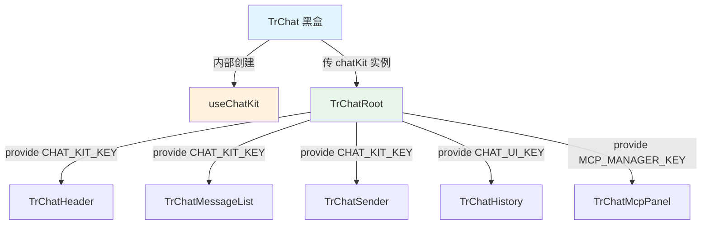

# TinyRobot Chat Kit 代码检视报告

> 基于 `packages/chat/src` 全量代码审读 + 业界最佳实践对标  
> 审读时间：2026-03-14

---

## 一、业界最佳实践对标

### 1.1 参考框架

| 框架 / SDK | 核心模式 | 关键设计 |
|:---|:---|:---|
| **Vercel AI SDK** (`@ai-sdk/react`) | `useChat()` hook + AI Elements 组件 | UI 与数据层彻底分离；hook 管理全部 chat state；组件库 (AI Elements) 仅负责渲染 |
| **Ant Design X** (`@ant-design/x`) | Compound Component + `useXChat` | `Bubble.List`, `Sender`, `Prompts` 原子组件 + 黑盒 `XChat` 组装；Provider/Consumer 注入 |
| **LobeHub** (`@lobehub/ui` + lobe-chat) | Store Slices + ChatList 组件 | Zustand store slices 分片管理状态；ChatList 支持 bubble/docs 多 variant；乐观更新 + 回滚；render props 深度定制 |
| **Shadcn Chat** | Headless + Copy-paste 组件 | `Conversation`, `Message` 等无样式组件，用户自行组合 |
| **Stream Chat (GetStream)** | Channel/MessageList/MessageInput | 三层架构：Core SDK → React Hooks → UI 组件；Channel 作为状态容器 |

### 1.2 业界共识原则

1. **UI 与状态彻底分离** — hook/composable 管理所有 chat 状态（messages、status、streaming），组件仅消费
2. **Compound Component Pattern** — 黑盒 = 白盒子组件的语法糖，不存在独立逻辑
3. **Provider 工厂 + 适配器** — 多模型切换通过工厂函数按需创建，而非静态实例
4. **渲染器注册表** — Bubble 内容渲染通过 match/priority 注册表，用户可插入、覆盖
5. **Slot / Render Props** — 组件提供充分的插槽/渲染函数，用于深度定制
6. **样式隔离 + Token 体系** — CSS 变量 / Design Token 分层，用户可覆盖但不需 `!important`
7. **乐观更新 + 错误回滚** — 发送消息时 UI 立即响应，失败时优雅回退（LobeHub 核心模式）
8. **多 Variant 渲染** — 同一消息列表支持多种展示形态（bubble / docs），适配不同场景

### 1.3 LobeHub 深度对标分析

LobeHub 是当前最成熟的开源 AI Chat 前端框架之一，其架构设计对 TinyRobot Chat Kit 有重要参考价值。

#### 1.3.1 架构分层对比

| 层次 | LobeHub | TinyRobot Chat Kit | 差距分析 |
|:-----|:--------|:-------------------|:---------|
| **状态管理** | Zustand Store Slices（agent / session / chat / topic 各自独立 slice） | `useChatKit` 单一 composable | LobeHub 的 slices 模式支持更细粒度的状态分离和组合；TinyRobot 当前把会话管理、消息操作、编辑状态全部塞在一个 composable 里 |
| **Action 分层** | 三层：Public Action → `internal_*` → `internal_dispatch*` | 扁平：composable 直接暴露方法 | LobeHub 的分层让参数校验、业务逻辑、状态更新各司其职；TinyRobot 的函数既做校验又做 splice 又做 send |
| **UI 组件** | `ChatList` 支持 `renderMessage` / `renderActions` / `renderItems` render props | `TrBubbleList` 通过 slots + BubbleProvider matcher 注入 | 两种方案各有优劣：render props 灵活性更高但 API 复杂；slots + matcher 更声明式但扩展性受限 |
| **消息展示** | `variant` prop 支持 `bubble` / `docs` 两种形态 | 仅 bubble 形态 | TinyRobot 暂不支持 docs 类展示，对知识库、文档对话等场景覆盖不足 |
| **乐观更新** | 核心特性：消息发送立即上屏，失败时优雅回滚 | 未实现：依赖底层 kit 的 requestState 驱动 | TinyRobot 的消息上屏依赖 engine 状态流转，无独立的乐观更新机制 |
| **错误处理** | 结构化错误分类 + retry + circuit breaker | 仅 `onError` 回调 | TinyRobot 缺少错误重试和分类机制 |
| **i18n** | `react-i18next` 全量国际化 | 硬编码中文 | 差距明显，已在 P2-2 记录 |

#### 1.3.2 LobeHub 的 Store Slices 模式（值得借鉴）

LobeHub 将全局状态拆分为多个 slice，每个 slice 包含：
- **State**：该 slice 管理的状态字段
- **Actions**：公开方法（如 `sendMessage`、`createTopic`）
- **Reducers**：状态变更的纯函数
- **Selectors**：派生状态的计算函数

```
store/chat/
  slices/
    aiChat/         ← AI 对话生命周期
      actions/conversationLifecycle.ts
    message/        ← 消息 CRUD
    topic/          ← 话题管理
    plugin/         ← 插件/工具调用
      actions/pluginTypes.ts
  store.ts          ← 组合所有 slices
```

**对 TinyRobot 的启示**：当前 `useChatKit` 是一个 188 行的 "大 composable"，随着功能增长会变得难以维护。可以考虑将其拆分为：
- `useChatMessages` — 消息 CRUD + 编辑
- `useChatRequest` — 请求生命周期 + 状态流转
- `useChatConversation` — 会话管理
- `useChatKit` — 组合层（组合以上三个）

#### 1.3.3 LobeHub ChatList 的定制化能力（值得借鉴）

LobeHub 的 `ChatList` 组件提供的定制点：

| 定制点 | 方式 | 说明 |
|:-------|:-----|:-----|
| `renderMessage` | Render Prop | 完全自定义单条消息的渲染 |
| `renderActions` | 按 role 注入 | 不同角色可以有不同的操作按钮 |
| `renderItems` | 按 role 注入 | 不同角色的消息容器样式不同 |
| `onActionsClick` | 回调 | 统一的操作点击处理入口 |
| `onAvatarsClick` | 回调 | 头像点击处理 |
| `onMessageChange` | 回调 | 消息内容变化处理 |
| `variant` | Prop | bubble / docs 形态切换 |
| `showHistoryDivider` | Prop | 历史消息分割线 |

**对 TinyRobot 的启示**：当前 `TrChatMessageList` 的定制能力主要依赖 BubbleProvider 的 matcher 机制，这在简单场景够用，但缺少：
1. **消息级别的操作回调**（如 `onActionClick`）— 当前 Feedback 是通过 slot 注入，而非组件原生支持
2. **历史消息分割线** — 常见需求（"以下是最新消息"）无内置支持
3. **头像点击处理** — 无内置支持

#### 1.3.4 LobeHub 的乐观更新模式（值得借鉴）

LobeHub 的消息发送流程：
1. 用户点击发送 → **立即**在消息列表中创建 user 和 assistant 的占位消息
2. UI 即时反馈（assistant 消息显示 loading 状态）
3. 后台异步发起 API 请求
4. 成功：用流式数据填充 assistant 消息
5. 失败：**回滚 UI**，显示错误提示，支持重试

**对 TinyRobot 的启示**：当前 `useChatKit.sendMessage` 直接调用 `engine.sendMessage`，消息的上屏时机完全由底层 kit 控制。如果网络延迟较高，用户发送后可能感到"无响应"。建议在 chat 层增加乐观上屏机制。

---

## 二、当前架构总览

### 2.1 目录结构

```
packages/chat/src/
├── components/
│   ├── TrChat.vue              ← 黑盒组装层 (217 行)
│   ├── TrChatRoot.vue          ← 状态注入层 (44 行)
│   ├── TrChatHeader.vue        ← 顶栏
│   ├── TrChatWelcome.vue       ← 欢迎页
│   ├── TrChatMessageList.vue   ← 消息列表
│   ├── TrChatFooter.vue        ← 底栏容器
│   ├── TrChatSender.vue        ← 输入框封装
│   ├── TrChatFeedback.vue      ← 反馈操作
│   ├── TrModelSelector.vue     ← 模型选择器
│   ├── TrChatMcpPanel.vue      ← MCP 面板
│   ├── history/                ← 历史记录子组件
│   ├── icons/                  ← 兼容保留，运行时图标已迁至 `@opentiny/tiny-robot-svgs`
│   └── render/                 ← Bubble 内容渲染器 (6 个)
├── composables/
│   ├── useChatKit.ts           ← 核心状态管理 (188 行)
│   ├── useDefaultBubbleConfig.ts
│   ├── useChatFeedback.ts
│   ├── useMcpManager.ts
│   ├── useFloatingDropdown.ts
│   ├── useKeyboardNavigation.ts
│   └── useHistoryState.ts
├── providers/                  ← API Provider 工厂
│   ├── factories.ts
│   ├── openai.ts
│   └── deepseek.ts
├── styles/                     ← Less 样式
├── utils/                      ← 工具函数
├── context.ts                  ← Injection Keys
├── types.ts                    ← 类型定义
└── index.ts                    ← 统一导出
```

### 2.2 架构模式评估



**总体判断**：架构方向正确，已实现 Compound Component Pattern 的基本骨架。但存在多个可优化点，详见下文。

---

## 三、问题检视（按严重程度排序）

### 🔴 P0 — 设计缺陷

#### P0-1：模型切换状态所有权重复 + 副作用重复触发

**位置**：
- [TrChat.vue:72-84](file:///d:/OpenTinyRepository/tiny-robot/packages/chat/src/components/TrChat.vue#L72-L84)
- [TrModelSelector.vue:43-47](file:///d:/OpenTinyRepository/tiny-robot/packages/chat/src/components/TrModelSelector.vue#L43-L47)

**问题描述**：

问题不只是"黑盒有白盒没有的逻辑"，更准确地说是**状态所有权重复 + 副作用重复触发**：

1. `TrModelSelector.handleSelectModel` 已经会调用 `chatKit.updateResponseProvider(factory.createProvider(model))`（line 46）
2. `TrChat` 又 `watch(selectedModel, ...)` 再次调用 `chatKit.updateResponseProvider(factory.createProvider(model))`（line 78）

同一次模型切换会导致 `updateResponseProvider` 被调用**两次**，创建两个 provider 实例，第二次覆盖第一次。这是典型的 "owner 不唯一" 问题。

**修复建议**：

模型切换只能有一个 owner。两种方案：
- 方案 A：`TrModelSelector` 作为唯一 owner，TrChat 删除 watch
- 方案 B：提取 `useModelSelector` composable，TrModelSelector 仅负责 UI，逻辑由 composable 统一管理

#### P0-2：MCP 双实例问题 — 面板开关与工具调用脱节

**位置**：
- [BlackboxDemo.vue:52-59](file:///d:/OpenTinyRepository/tiny-robot/packages/chat/demo/src/components/BlackboxDemo.vue#L52-L59)
- [TrChatRoot.vue:31](file:///d:/OpenTinyRepository/tiny-robot/packages/chat/src/components/TrChatRoot.vue#L31)
- [TrChatMcpPanel.vue:17](file:///d:/OpenTinyRepository/tiny-robot/packages/chat/src/components/TrChatMcpPanel.vue#L17)

**问题描述**：

这是一个架构级缺陷，不仅仅是 Demo 层问题：

```
BlackboxDemo 中：
  mcpManager = useMcpManager()          ← 实例 A
  toolPlugin({ getTools: A.getTools })  ← 工具调用绑定实例 A

TrChatRoot 中：
  mcpManager = useMcpManager()          ← 实例 B (line 31)
  provide(MCP_MANAGER_KEY, B)           ← provide 实例 B

TrChatMcpPanel 中：
  inject(MCP_MANAGER_KEY)               ← 消费实例 B
```

结果：用户在 MCP 面板（实例 B）中启用/禁用插件和工具，但 `toolPlugin` 绑定的是实例 A 的 `getTools/callTool`。**面板操作完全不影响实际的工具调用**。

**修复建议**：

MCP Manager 需要单一实例：
1. `TrChatRoot` 不应自动创建 `mcpManager`，而是接受外部传入或不创建
2. 黑盒 `TrChat` 接受 `mcpManager` prop，统一传入 Root
3. 或者将 MCP Manager 的创建放在 `useChatKit` 中管理，作为可选依赖

#### P0-3：TrChatRoot 的两种模式实现存在安全隐患

**位置**：[TrChatRoot.vue:16-25](file:///d:/OpenTinyRepository/tiny-robot/packages/chat/src/components/TrChatRoot.vue#L16-L25)

**问题描述**：

当使用模式 A（传 responseProvider）时，如果 `responseProvider` 为 `undefined`（用户忘记传），`conditionalProp` 返回 `undefined`，类型断言 `as UseChatKitOptions['responseProvider']` 会绕过检查，导致运行时创建了一个 provider 为 `undefined` 的 chatKit 实例，错误只会在发送消息时才暴露。

**修复建议**：

添加运行时校验：

```typescript
if (!conditionalProp(props, 'chatKit') && !conditionalProp(props, 'responseProvider')) {
  throw new Error('[TrChatRoot] Either chatKit or responseProvider must be provided')
}
```

#### P0-4：前端直接持有模型 API Key — 安全边界缺失

**位置**：
- [BlackboxDemo.vue:14](file:///d:/OpenTinyRepository/tiny-robot/packages/chat/demo/src/components/BlackboxDemo.vue#L14)
- [openai.ts:31](file:///d:/OpenTinyRepository/tiny-robot/packages/chat/src/providers/openai.ts#L31)

**问题描述**：

Demo 直接通过 `import.meta.env.VITE_DEEPSEEK_API_KEY` 读取 API Key，provider 在浏览器中直接发送 `Authorization: Bearer` 请求头。这在 demo 场景可以接受，但：

1. **chat 包的 `providers/openai.ts` 是发布到 npm 的正式代码**，不是 demo 专属
2. 如果 chat-cli 生成的项目也采用这种模式，用户可能直接在生产环境暴露 Key
3. 文档和代码未明确标注"仅限开发/demo 使用"与"生产环境应使用 BFF/Server Adapter"的边界

**修复建议**：

1. 在 `providers/` 代码和导出文档中明确标注 `@security demo-only` 或 `@warning browser-side key exposure`
2. 提供 `ServerProxyProvider` 作为生产推荐方案，通过 BFF 转发 API 请求
3. chat-cli 生成的模板应默认使用 server adapter 模式，仅在开发模式 fallback 到直连
4. 将此条作为 chat-cli 设计的硬性约束

#### P0-5：Injection Key 作为公开 API 导出 — 诱导用户绕过 Root

**位置**：[index.ts:47](file:///d:/OpenTinyRepository/tiny-robot/packages/chat/src/index.ts#L47)

**问题描述**：

```typescript
export { CHAT_KIT_KEY, MCP_MANAGER_KEY, CHAT_UI_KEY } from './context'
```

包将内部的 Injection Key 作为主路径 API 公开导出。WhiteboxDemo 正是利用了这一点，绕过 `TrChat.Root` 自己 `provide` 三个 key（WhiteboxDemo.vue:74-83），相当于重新实现了 Root 的职责。

这会带来两个后果：
1. **用户被诱导写出更复杂的代码** — 本应用 `TrChat.Root` 一行解决的事，变成 20+ 行手动 provide
2. **契约不稳定** — 如果 Root 内部增加新的 provide（如 BUBBLE_CONFIG_KEY），自行 provide 的用户代码会静默丢失功能

**修复建议**：

1. 将 Injection Key 从主导出路径移除，改为 `@opentiny/tiny-robot-chat/internal` 子路径导出
2. 如果确实需要高级用户直接 provide，通过文档标注为"高级用法 / escape hatch"
3. WhiteboxDemo 应改为使用 `TrChat.Root :chat-kit="chatKit"` 方式

---

### 🟡 P1 — 需要优化

#### P1-0：useChatKit 的 responseProvider 初始化模式脆弱（需补回归测试）

**位置**：[useChatKit.ts:30-37](file:///d:/OpenTinyRepository/tiny-robot/packages/chat/src/composables/useChatKit.ts#L30-L37)

**问题描述**：

`useConversation` 初始化时传入的是 `responseProviderRef.value`（解包值），后续通过 `watchEffect`（line 90）回写当前 engine 的 `responseProvider`。经过代码验证：`useMessage` 内部将 provider 存为独立 ref（useMessage.ts:56），每个 turn 开始时快照一次（useMessage.ts:264），因此 watchEffect 的同步时机实际上是足够的。

但这种"先传静态值、再用副作用补同步"的模式仍然是脆弱的，属于**需要补充回归测试覆盖的脆弱点**，而非已确认的架构缺陷。

**修复建议**：

1. 补充单元测试：验证 `updateResponseProvider` 后发送消息确实使用新 provider
2. 长期：考虑直接传递 Ref 对象给底层 kit，消除手动同步

#### P1-1：TrChatMessageList 和 TrChat 存在重复的 Slot 过滤逻辑

**位置**：
- [TrChat.vue:106-113](file:///d:/OpenTinyRepository/tiny-robot/packages/chat/src/components/TrChat.vue#L106-L113)
- [TrChatMessageList.vue:17-23](file:///d:/OpenTinyRepository/tiny-robot/packages/chat/src/components/TrChatMessageList.vue#L17-L23)

**问题描述**：

`BUBBLE_LIST_SLOTS` 白名单过滤逻辑在两个组件中完全重复。黑盒 `TrChat` 和白盒 `TrChatMessageList` 各写了一份完全相同的 `computed` 过滤代码。

**修复建议**：

方案一（推荐）：提取为 `useSlotFilter(slots, allowedNames)` composable。
方案二：黑盒 `TrChat` 直接信任 `TrChatMessageList` 内部过滤，不在外层再做一次。

#### P1-2：TrChatSender Slot 透传使用硬编码而非动态遍历

**位置**：[TrChatSender.vue:47-64](file:///d:/OpenTinyRepository/tiny-robot/packages/chat/src/components/TrChatSender.vue#L47-L64)

**问题描述**：

每个 slot 都需要手动写一遍 `v-if + template`（共 6 个），当 TrSender 新增 slot 时，TrChatSender 需要同步修改，容易遗漏。

**修复建议**：

使用动态 slot 遍历透传，与 `TrChatMessageList` 的写法保持一致。

#### P1-3：TrChatFeedback 样式泄漏

**位置**：[TrChatFeedback.vue:54-58](file:///d:/OpenTinyRepository/tiny-robot/packages/chat/src/components/TrChatFeedback.vue#L54-L58)

**问题描述**：

使用了**全局（非 scoped）样式** + `!important`。会影响套件外用户独立使用的 `TrFeedback` 组件实例的样式。

**修复建议**：

1. 改为 `scoped` + `:deep()` 选择器
2. 或优先使用 CSS 变量覆盖样式，避免 `!important`

#### P1-4：useChatFeedback 与 chatKit 强耦合

**位置**：[useChatFeedback.ts:16](file:///d:/OpenTinyRepository/tiny-robot/packages/chat/src/composables/useChatFeedback.ts#L16)

**问题描述**：

`useChatFeedback` 作为 composable，内部直接 `inject(CHAT_KIT_KEY)!`（非 null 断言），意味着：
1. 必须在 `TrChatRoot` 的子树中使用，否则运行时崩溃
2. 无法在 TrChatRoot 外部独立测试

作为对比，`TrChatFeedback.vue` 用了安全 inject `inject(CHAT_KIT_KEY, null)`，但它调用的 `useChatFeedback` 内部没有做同样的防御。

**修复建议**：

将 `chatKit` 作为 `useChatFeedback` 的参数传入，非 inject。

#### P1-5：icons 目录膨胀 + 职责越界

**位置**：`packages/chat/src/utils/iconMap.ts`（运行时映射） + `packages/chat/src/components/icons`（兼容保留目录）

**问题描述**：

11 个 SVG Provider 图标组件（openai、claude 等），唯一用途是 `TrModelSelector` 中显示图标。问题：
1. **职责越界**：Provider 品牌资产不应放在 chat 套件中
2. **扩展性差**：新增 Provider = 新增 SVG + 修改 iconMap
3. **包体积**：全量打包

**修复建议**：

方案一：迁移到 `@opentiny/tiny-robot-svgs`
方案二：`ModelOption` 增加 `icon` 字段，用户自行传入

**当前实施状态**：

- 已完成迁移：内置 provider icon 运行时来源统一为 `@opentiny/tiny-robot-svgs`
- 已保留扩展点：`ModelOption.icon`
- 兼容清理待办：`packages/chat/src/components/icons` 可在稳定观察期后移除

#### P1-6：useMcpManager 含大量 Mock 代码

**位置**：[useMcpManager.ts:61-68](file:///d:/OpenTinyRepository/tiny-robot/packages/chat/src/composables/useMcpManager.ts#L61-L68)

**问题描述**：

`callTool` 返回硬编码 mock 结果，`handlePluginCreate` 只打印日志。发布为 npm 包时用户会遇到无法工作的 MCP 功能。

**修复建议**：

将 `callTool` 改为必须由用户提供的回调参数，或提供明确错误提示。

---

### 🔵 P2 — 关注点

#### P2-1：types.ts 中存在冗余的类型定义

**位置**：[types.ts:191-208](file:///d:/OpenTinyRepository/tiny-robot/packages/chat/src/types.ts#L191-L208)

`BubbleRendererMatchType` 系列类型与 `@opentiny/tiny-robot` 导出的 `BubbleContentRendererMatch` 是重复定义。建议删除，统一使用 tiny-robot 导出的类型。

#### P2-2：文案硬编码

UI 文案全部硬编码中文（`"新建对话"`, `"复制"`, `"重新生成"` 等）。作为 SDK 会限制后续国际化场景。建议先统一抽取到资源文件中，作为后期整体国际化的基座；待上游组件具备一致的国际化能力后，再做 runtime i18n 接入。

#### P2-3：Less 选型与主包 tiny-robot 不一致

chat 包使用 Less，主包使用纯 CSS / CSS 变量。当前 Less 仅用于 BEM 嵌套，迁移成本低，建议统一为纯 CSS。

#### P2-4：useFloatingDropdown 直接操作 DOM style

直接 `Object.assign(el.style, ...)` 不符合 Vue 响应式理念。建议返回 `floatingStyles` 响应式对象，通过 `:style` 绑定消费。

---

## 四、Demo 检视

### 4.1 BlackboxDemo 问题

**位置**：[BlackboxDemo.vue](file:///d:/OpenTinyRepository/tiny-robot/packages/chat/demo/src/components/BlackboxDemo.vue)

| # | 问题 | 说明 |
|:--|:-----|:-----|
| 1 | `getInitialProvider()` 与 TrChat 内部重复 | 黑盒内部已有 `getInitialProvider` 逻辑，Demo 中又写了一次。直接传 `default-model` 即可 |
| 2 | MCP Manager 在黑盒外创建 | `useMcpManager()` 在 Demo 中创建但无法传入黑盒（TrChat 不接受 mcpManager prop） |
| 3 | `:deep()` 样式覆盖 `.tr-chat` 布局 | 说明黑盒默认布局不满足需求，应在 src 中修复而非 Demo 中 hack |

### 4.2 WhiteboxDemo 问题

**位置**：[WhiteboxDemo.vue](file:///d:/OpenTinyRepository/tiny-robot/packages/chat/demo/src/components/WhiteboxDemo.vue)

| # | 问题 | 说明 |
|:--|:-----|:-----|
| 1 | 手动 `provide(CHAT_KIT_KEY, chatKit)` | 没有使用 `TrChat.Root`，而是自己 provide 三个 key，相当于重新实现了 Root 的职责 |
| 2 | 白盒用法过于复杂 | 需要 20+ 行 setup 代码才能启动（创建 chatKit、provide 三个 key、创建 mcpManager），白盒"自由组装"的初衷没有达成 |
| 3 | `<div class="tr-chat">` 手动添加 | 白盒用户需要自己写 `.tr-chat` wrapper 并手动确保 flex 布局，说明 `TrChat.Root` 或某个 Layout 组件应该提供这个容器 |
| 4 | 模型选择丢失样式 | `TrModelSelector` 放在 `TrChat.Sender` 的 footer slot 中时位置和大小不协调 |

### 4.3 Demo 核心结论

> [!IMPORTANT]
> **白盒 Demo 复杂度过高**是当前最大的 UX 问题。白盒用户理想的代码量应该接近这样：

```vue
<script setup>
import { TrChat, useChatKit } from '@opentiny/tiny-robot-chat'

const chatKit = useChatKit({ responseProvider: myProvider })
</script>

<template>
  <TrChat.Root :chat-kit="chatKit">
    <TrChat.Layout>
      <TrChat.Header title="My Bot" show-history />
      <TrChat.MessageList auto-scroll />
      <TrChat.Footer>
        <TrChat.Sender />
      </TrChat.Footer>
      <TrChat.History />
    </TrChat.Layout>
  </TrChat.Root>
</template>
```

但目前用户还需要自己：手动 provide 三个 Injection Key、手动创建 `BubbleProvider`、手动写 `.tr-chat` 容器样式。修正后的目标应是 `Root` 只负责 provide，`Layout` 负责容器布局与默认 Bubble 环境。

---

## 五、重构方案

### 5.1 重构目标

1. **黑盒 0 独有逻辑** — TrChat 只做组装，所有能力在白盒子组件中完成
2. **白盒最小启动** — 5 行 setup + 模板标签即可跑通完整 Chat
3. **职责分离** — Root 只管上下文 provide，Layout 管布局 + BubbleProvider，两者不混合
4. **安全边界** — 明确区分 demo-only 和 production 模式，API Key 不能在前端暴露

> [!WARNING]
> 原方案 F1-F3 计划让 `TrChatRoot` 同时承担状态 provide + 容器布局 + BubbleProvider + 默认 renderer 配置，这与文档前面强调的 "UI/状态分离" 原则冲突。当前 Root 是纯 provide 层（TrChatRoot.vue:16），应保持不变。修正为 **Root + Layout 分离**方案。

### 5.2 分阶段实施计划

#### Phase 1：基座修复（本阶段）

> [!TIP]
> 确保 demo 中的黑盒和白盒案例功能和样式正常

| 编号 | Action | 涉及文件 | 说明 |
|:-----|:-------|:---------|:-----|
| **F1** | 新增 `TrChat.Layout` 组件 | 新增 `TrChatLayout.vue` | 提供 `.tr-chat` 容器 + flex 布局 + BubbleProvider + useDefaultBubbleConfig。**TrChatRoot 保持纯 provide 层不变** |
| **F2** | TrChatRoot 运行时参数校验 | `TrChatRoot.vue` | P0-3 修复 |
| **F3** | MCP Manager 单实例修复 | `TrChatRoot.vue` + `TrChat.vue` | P0-2 修复：Root 不自动创建 mcpManager，改为接受外部传入 |
| **F4** | 模型切换 owner 唯一化 | `TrChat.vue` + `TrModelSelector.vue` | P0-1 修复：TrChat 删除 watch selectedModel 的副作用 |
| **F5** | TrChatFeedback 样式改 scoped | `TrChatFeedback.vue` | P1-3 修复 |
| **F6** | Slot 重复过滤逻辑提取 | 新增 `composables/useSlotFilter.ts` | P1-1 修复 |
| **F7** | TrChatSender 动态 slot 透传 | `TrChatSender.vue` | P1-2 修复 |
| **F8** | useChatFeedback 参数化 chatKit | `useChatFeedback.ts` | P1-4 修复 |
| **F9** | types.ts 删除冗余类型 | `types.ts` | P2-1 修复 |
| **F10** | Injection Key 内部化 | `index.ts` + `package.json` exports | P0-5 修复：主导出移除，改为 `/internal` 子路径。**这是破坏性变更，需先 deprecate 再在 major release 落地** |
| **F11** | providers 安全标注 | `providers/*.ts` | P0-4 修复：添加 JSDoc @security 警告 |
| **F12** | Demo 黑盒/白盒对齐验证 | `demo/` | WhiteboxDemo 改用 TrChat.Root + TrChat.Layout；确保两种模式功能样式一致 |

#### Phase 2：能力下沉（下一阶段）

| 编号 | Action | 说明 |
|:-----|:-------|:-----|
| **S1** | 提取 `useModelSelector` composable | P0-1 进一步优化，TrModelSelector 仅负责 UI |
| **S2** | icons 迁移到 `tiny-robot-svgs` | P1-5 修复 |
| **S3** | useMcpManager 去 mock 化 | P1-6 修复，callTool 改为必须参数 |
| **S4** | responseProvider 补回归测试 | P1-0 修复（短期补测试，长期协调 kit 层接口） |
| **S5** | Less -> 纯 CSS 迁移 | P2-3 修复 |
| **S6** | 文案资源基座 | P2-2 修复 |
| **S7** | Provider 安全分层 | P0-4 进一步：提供 ServerProxyProvider + chat-cli 默认使用 BFF 模式 |
| **S8** | manifest/config 契约定义 | 见 5.4 节 |

### 5.3 目标目录结构（Phase 1 完成后）

```
packages/chat/src/
├── components/
│   ├── TrChat.vue              ← 纯组装，0 独有逻辑
│   ├── TrChatRoot.vue          ← 纯 provide 层：chatKit / UI / MCP 上下文注入
│   ├── TrChatLayout.vue        ← 容器布局 + BubbleProvider + 默认 bubble 配置
│   ├── TrChatHeader.vue
│   ├── TrChatWelcome.vue
│   ├── TrChatMessageList.vue   ← 消费 Layout 提供的默认 bubble 环境，允许 props 覆盖
│   ├── TrChatFooter.vue
│   ├── TrChatSender.vue        ← 动态 slot 透传
│   ├── TrChatFeedback.vue      ← scoped 样式
│   ├── TrModelSelector.vue
│   ├── TrChatMcpPanel.vue
│   ├── history/
│   ├── icons/                  ← legacy cleanup target，运行时不再作为主来源
│   └── render/
├── composables/
│   ├── index.ts
│   ├── useChatKit.ts
│   ├── useDefaultBubbleConfig.ts
│   ├── useChatFeedback.ts      <- chatKit 参数化
│   ├── useMcpManager.ts
│   ├── useFloatingDropdown.ts
│   ├── useKeyboardNavigation.ts
│   ├── useHistoryState.ts
│   └── useSlotFilter.ts        <- 新增
├── providers/                  <- 添加 @security 标注
├── styles/
├── utils/
├── context.ts                  <- 内部使用，不从主路径导出
├── types.ts                    <- 精简
└── index.ts                    <- 移除 Injection Key 导出
```

### 5.4 chat-cli 公共契约：manifest/config -> adapter -> preset UI

> [!IMPORTANT]
> 当前公开 API 要求用户传入函数型能力（如 `responseProvider`、`providerFactories`），这适合手写集成但**不适合 CLI 稳定生成**。需要定义一个声明式的配置契约层。

#### 问题

chat-cli 生成的代码需要稳定、可序列化的配置接口。当前情况：

```typescript
// 当前：函数型 API，无法通过 JSON/YAML 配置驱动
createOpenAIFactory({
  apiKey: '...',             // ← 安全隐患
  systemPrompt: '...',
})
```

#### 目标分层

```
manifest.json / .env        ← 用户声明（模型、Key 引用、系统提示词）
       ↓
Adapter Layer               ← 从 manifest 解析出 provider/factory
       ↓
Preset UI                   ← 基于 adapter 输出渲染黑盒组件
```

#### 建议的公共 API

chat-cli 不应直接生成 `ModelOption[]` / `ModelProviderFactory[]` 的组装代码，而应只依赖一层稳定入口，例如：

```typescript
const manifest = loadChatConfig()
const adapter = createChatAdapterFromConfig(manifest)
const preset = createPresetChatProps(adapter)
```

其中：
- `loadChatConfig()`：加载并校验 `chat.config.json`
- `createChatAdapterFromConfig()`：把声明式配置解析为运行时 adapter
- `createPresetChatProps()`：为 `TrChat` / `TrChat.Layout` 产出稳定 props

这样 CLI 生成代码只依赖公共契约，不直接感知内部 `factory` 细节。

#### 契约设计方向

```jsonc
// chat.config.json（chat-cli 生成 + 用户编辑）
{
  "models": [
    { "id": "deepseek-chat", "provider": "deepseek", "label": "DeepSeek Chat" },
    { "id": "gpt-4o", "provider": "openai", "label": "GPT-4o" }
  ],
  "providers": {
    "deepseek": { "type": "openai-compatible", "baseURL": "/api/proxy/deepseek" },
    "openai": { "type": "openai-compatible", "baseURL": "/api/proxy/openai" }
  },
  "defaults": {
    "model": "deepseek-chat",
    "systemPrompt": "You are a helpful assistant."
  }
}
```

注意：
- **Key 不在配置文件中** — 通过环境变量或服务端注入
- **baseURL 指向 BFF 代理** — 默认不直连模型 API
- Adapter 层从配置文件解析出 `ModelOption[]` + `ModelProviderFactory[]`

**阶段**：Phase 2（S8），与 chat-cli 优化同步推进

---

## 六、执行台账

### 6.1 问题清单

| 编号 | 级别 | 问题 | 对应动作 | 计划阶段 |
|:-----|:-----|:-----|:---------|:---------|
| P0-1 | 🔴 | 模型切换状态所有权重复 + 副作用重复触发 | F4 / S1 | Phase 1 / 2 |
| P0-2 | 🔴 | MCP 双实例 — 面板开关与工具调用脱节 | F3 | Phase 1 |
| P0-3 | 🔴 | TrChatRoot 缺少参数校验 | F2 | Phase 1 |
| P0-4 | 🔴 | 前端直接持有 API Key — 安全边界缺失 | F11 / S7 | Phase 1 / 2 |
| P0-5 | 🔴 | Injection Key 公开导出 — 诱导用户绕过 Root | F10 | Phase 1 |
| P1-0 | 🟡 | responseProvider 初始化模式脆弱（需补测试） | S4 | Phase 2 |
| P1-1 | 🟡 | Slot 过滤逻辑重复 | F6 | Phase 1 |
| P1-2 | 🟡 | TrChatSender slot 硬编码 | F7 | Phase 1 |
| P1-3 | 🟡 | TrChatFeedback 样式泄漏 | F5 | Phase 1 |
| P1-4 | 🟡 | useChatFeedback 强耦合 inject | F8 | Phase 1 |
| P1-5 | 🟡 | icons 职责越界 | S2 | Phase 2 |
| P1-6 | 🟡 | useMcpManager mock 代码 | S3 | Phase 2 |
| P2-1 | 🔵 | 冗余类型定义 | F9 | Phase 1 |
| P2-2 | 🔵 | 文案硬编码 | S6 | Phase 2 |
| P2-3 | 🔵 | Less 选型不一致 | S5 | Phase 2 |
| P2-4 | 🔵 | useFloatingDropdown DOM 操作 | Backlog | Phase 2+ |

### 6.2 增量优化 Backlog

以下条目不属于“先修坏点”的基座任务，但会显著影响长期可维护性和 chat-cli 体验：

| 编号 | 优化项 | 价值 | 计划阶段 |
|:-----|:-------|:-----|:---------|
| B1 | `useChatKit` 状态分片 | 降低 composable 膨胀，提升测试性 | Phase 2 |
| B2 | 消息乐观更新 + 错误回滚 | 提升发送反馈速度和失败体验 | Phase 2 |
| B3 | 消息操作统一回调入口 | 统一埋点与业务扩展入口 | Phase 2 |
| B4 | 结构化错误 + 重试机制 | 提升生产可用性和恢复能力 | Phase 2 |
| B5 | ChatList `docs` variant | 扩展知识库 / 文档问答场景 | Phase 2+ |

> [!NOTE]
> 执行顺序应优先处理 P0/P1 基座缺陷，再进入 Backlog 优化。`progress.md` 将以此台账为唯一跟踪入口。

---

## 七、项目推进计划

### 7.1 Phase 1：基座修复

**目标**：修正架构级缺陷，收敛白盒接入路径，确保 demo 与正式 API 的主路径一致。

**交付范围**：
- Layout 组件落地，建立 `Root + Layout` 双层模型
- MCP 单实例修复
- 模型切换 owner 唯一化
- Root 参数校验、安全标注、Key 内部化
- 样式 / slot / 类型等低风险修复
- Demo 黑盒 / 白盒统一到主路径用法

**验收标准**：
1. 白盒示例无需手动 `provide` Injection Key
2. 黑盒与白盒都基于同一份 `mcpManager` / `chatKit` 主链路
3. `TrChat.Root` 不承担布局职责，`TrChat.Layout` 承担默认布局职责
4. demo 中不再出现与正式 API 相冲突的“绕路写法”
5. 公开导出面与文档示例一致，不再鼓励用户绕过 Root

### 7.2 Phase 2：能力下沉

**目标**：让 chat kit 从“能用的 demo 组件集合”升级为“可被 chat-cli 稳定消费的会话套件”。

**交付范围**：
- `useModelSelector`、`useMcpManager` 等能力解耦
- provider 安全分层与 BFF 推荐路径
- `manifest/config -> adapter -> preset UI` 公共契约
- 测试补充、样式与文案资源收敛
- 为后续高级能力预留稳定扩展点

**验收标准**：
1. chat-cli 可仅依赖声明式配置生成接入代码
2. 生成代码不直接感知内部 factory 细节
3. 默认接入路径不要求浏览器侧暴露模型 API Key
4. 关键状态切换与 provider 更新有回归测试兜底

### 7.3 Phase 2 Backlog：体验增强

这部分属于“在基座稳定之后继续抬高上限”的增强项，不阻塞首轮交付：

| 编号 | 事项 | 对应价值 |
|:-----|:-----|:---------|
| B1 | `useChatKit` 状态分片 | 可维护性 |
| B2 | 乐观更新 + 回滚 | 交互体验 |
| B3 | 统一消息操作入口 | 扩展性 |
| B4 | 结构化错误 + 重试 | 稳定性 |
| B5 | `docs` variant | 场景覆盖 |

---

## 八、设计依据：LobeHub 对标

> [!NOTE]
> 本节不是独立 backlog，而是 `6.2 增量优化 Backlog` 的设计依据。保留这部分的目的，是说明为什么 B1-B5 值得做，以及它们分别参考了 LobeHub 的哪些成熟模式。

### 8.1 B1：`useChatKit` 状态分片

**对标点**：LobeHub 的 Store Slices 模式  
**当前问题**：`useChatKit` 目前同时承担会话、消息、编辑、请求状态等职责，随着功能增长会持续膨胀。

**参考方向**：

```
composables/
  useChatMessages.ts
  useChatRequest.ts
  useChatConversation.ts
  useChatKit.ts
```

**预期收益**：
- 单个 composable 职责更单一，便于测试和演进
- 用户可以按需复用子能力，而不是永远绑定大一统入口
- 为 chat-cli 后续生成更细粒度的模板留出空间

### 8.2 B2：消息乐观更新 + 错误回滚

**对标点**：LobeHub / ChatGPT 的发送反馈模式  
**当前问题**：当前消息上屏依赖底层 engine 状态流转；在网络延迟场景下，用户可能感知到“发送后无反馈”。

**参考方向**：

```typescript
function sendMessage(content: string) {
  const userMsg = createOptimisticMessage('user', content)
  messages.value.push(userMsg)

  const assistantMsg = createOptimisticMessage('assistant', '', { loading: true })
  messages.value.push(assistantMsg)

  try {
    await engine.sendMessage(content)
  } catch (error) {
    rollbackOptimisticMessages([userMsg.id, assistantMsg.id])
  }
}
```

**预期收益**：
- 发送后立即有 UI 反馈
- 失败路径可回滚，不会残留错误占位消息
- 更接近用户对现代 AI Chat 产品的体验预期

### 8.3 B3：消息操作统一回调入口

**对标点**：LobeHub `onActionsClick` 一类统一事件入口  
**当前问题**：复制、编辑、重新生成、赞踩等操作分散在 `TrChatFeedback` 和 `useChatFeedback` 中，缺少统一业务接入点。

**参考方向**：

```typescript
interface TrChatMessageListProps {
  onActionClick?: (action: string, message: ChatMessage, index: number) => void
}
```

**预期收益**：
- 用户可以统一接埋点、权限、审核、业务逻辑
- 操作组件与业务层的耦合更低
- 更适合 chat-cli 生成可扩展的模板代码

### 8.4 B4：结构化错误处理 + 重试机制

**对标点**：LobeHub 的 retry / error 分类思路  
**当前问题**：现在错误处理主要通过 `onError` 回调向外透出，缺少可供 UI 直接消费的结构化错误信息。

**参考方向**：

```typescript
type ChatErrorType = 'network' | 'auth' | 'rateLimit' | 'provider' | 'unknown'

interface UseChatKitReturn {
  lastError: ComputedRef<{
    type: ChatErrorType
    message: string
    retryable: boolean
  } | null>
  retry: () => Promise<void>
}
```

**预期收益**：
- UI 可以根据错误类型显示更准确的提示
- 重试逻辑从业务层回收到 kit 层
- 对生产可用性帮助明显，尤其适合 chat-cli 生成应用

### 8.5 B5：ChatList `docs` variant

**对标点**：LobeHub `bubble / docs` 多形态展示  
**当前问题**：`TrChatMessageList` 目前主要围绕 bubble 聊天形态设计，对知识库问答、文档解读类场景覆盖不足。

**参考方向**：

```vue
<TrChat.MessageList variant="docs" />
```

**预期收益**：
- 让同一套会话能力覆盖更多 AI 应用场景
- chat-cli 后续可按模板类型生成不同 UI 形态
- 避免用户为了“文档问答”另起一套消息列表体系

### 8.6 取舍说明

LobeHub 的设计对 TinyRobot Chat Kit 很有参考价值，但不应机械照搬。当前建议是：

1. 先吸收其在状态分层、消息反馈、错误处理上的成熟模式
2. 保留 TinyRobot 在 Vue、BubbleProvider、matcher 机制上的现有优势
3. 所有对标项都以后续 `chat-cli` 的可生成性、可配置性为落点，而不是只追求功能对齐

---

## 九、风险与依赖

### 8.1 风险

| 风险 | 说明 | 应对策略 |
|:-----|:-----|:---------|
| 破坏性导出变更 | Injection Key 内部化会影响已有用户代码 | 先 deprecate，再 major release 落地 |
| 安全模型迁移成本 | 从浏览器直连迁移到 BFF 需要新增服务端模板 | chat-cli 默认生成 server adapter，并保留 demo-only 直连方案 |
| Root / Layout 职责调整 | 需要同步更新 demo、导出面、文档 | Phase 1 将 demo 对齐列为强制验收项 |
| MCP 能力去 mock 化 | 真实工具桥接可能牵涉更上游接口 | 先收敛实例模型，再定义最小 callback 契约 |

### 8.2 依赖

| 依赖项 | 影响 |
|:-------|:-----|
| `tiny-robot-kit` 对 provider / request 生命周期的接口能力 | 影响 S4、B2、B4 的实现方式 |
| chat-cli 对配置文件与模板输出的形态约束 | 影响 S7、S8 的公共契约设计 |
| 版本发布策略 | 影响 F10 这类破坏性变更的落地节奏 |

---

## 十、实施顺序建议

### 9.1 推荐执行顺序

1. 先完成 Phase 1 的 F1-F4，修正主链路架构问题
2. 再完成 F5-F12，统一导出面、demo 与主路径示例
3. 进入 Phase 2，先做 S7-S8，优先把安全边界和 chat-cli 契约定下来
4. 再做 S1-S6，逐步清理能力与实现细节
5. 最后按 B1-B5 逐项提升体验和扩展能力

### 9.2 当前建议

当前最适合开始实现的是：
- F1 `TrChat.Layout`
- F3 MCP 单实例
- F4 模型切换 owner 唯一化

这三项能最快把主路径架构拉正，也最容易在 demo 中直接验证收益。
