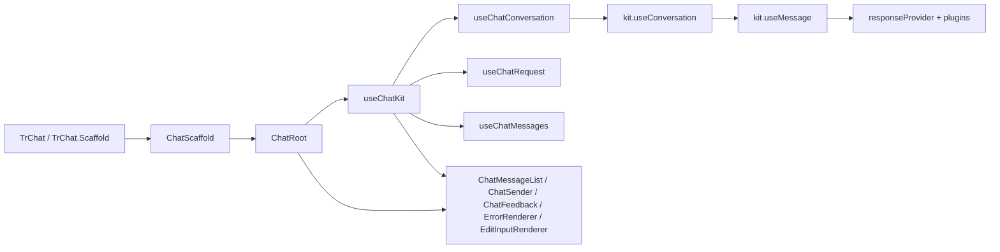

# useChatKit 实现详解

## 1. 文档目的

这份文档用于详细梳理 `packages/chat` 中 `useChatKit` 的设计与实现，目标是帮助团队成员从源码层面理解：

- `useChatKit` 在整个 chat 运行时中的位置
- 它如何建立在 `@opentiny/tiny-robot-kit` 的 `useConversation` / `useMessage` 之上
- 它相对基础 `kit` 增强了哪些面向产品交互的能力
- 一次发送、一次失败、一次重试、一次编辑重发分别是怎么走的

核心结论先说在前面：

> `useChatKit` 不是新的消息引擎，而是 chat 包在 `kit` 之上的“运行时外观层”。底层请求执行、流式消费、插件机制、多会话引擎仍然在 `kit`；`chat` 负责把这些原始能力编排成更适合 UI 和产品交互消费的运行时接口。

---

## 2. useChatKit 在整体架构中的位置

### 2.1 运行时总链路

当前 chat 包运行时主链可以概括为：

```text
TrChat / TrChat.Scaffold / TrChat.Root
  -> ChatScaffold / ChatRoot
  -> useChatKit
  -> useChatConversation / useChatRequest / useChatMessages
  -> useConversation (kit)
  -> useMessage (kit)
  -> responseProvider + plugins
```

可以配合下面这张图理解：



### 2.2 chat 与 kit 的职责边界

从代码职责上看，两层边界很清楚：

- `packages/kit`
  - 提供底层消息引擎 `useMessage`
  - 提供多会话管理 `useConversation`
  - 提供请求状态、流式 chunk 合并、插件生命周期、存储策略
- `packages/chat`
  - 提供 chat 级运行时 `useChatKit`
  - 提供面向 UI 的状态语义
  - 提供失败重试、编辑重发、乐观态、错误归一化
  - 提供和组件树的 `provide / inject` 集成

所以理解 `useChatKit` 的最好方式不是把它当作“独立引擎”，而是把它当作“chat 场景下的组合层和适配层”。

---

## 3. 对外 API：它暴露了什么

`useChatKit` 的选项和返回值定义在 `packages/chat/src/types/core.ts`。

### 3.1 输入

```ts
export interface UseChatKitOptions {
  responseProvider: ResponseProvider
  plugins?: UseMessagePlugin[]
  storage?: ConversationStorageStrategy
  initialMessages?: ChatMessage[]
  onFinish?: (message: ChatMessage) => void
  onError?: (error: Error) => void
}
```

从接口可以看出，它要求的仍然是 `kit` 那一套最核心能力：

- 一个 `responseProvider`
- 一组 message plugins
- 一个 conversation storage
- 初始消息种子
- turn 完成与错误回调

### 3.2 输出

```ts
export interface UseChatKitReturn extends Pick<
  UseConversationReturn,
  | 'activeConversationId'
  | 'activeConversation'
  | 'createConversation'
  | 'switchConversation'
  | 'deleteConversation'
  | 'updateConversationTitle'
  | 'abortActiveRequest'
> {
  conversations: UseConversationReturn['conversations']
  messages: ComputedRef<ChatMessage[]>
  status: ComputedRef<ChatStatus>
  lastError: ComputedRef<ChatErrorInfo | null>
  sendMessage: (content: string, data?: StructuredData) => void
  startEditMessage: (messageIndex: number) => void
  cancelEditMessage: (messageIndex: number) => void
  isMessageEditing: (messageIndex: number) => boolean
  editMessage: (messageIndex: number, newContent: string) => void
  updateResponseProvider: (provider: ResponseProvider) => void
  abort: () => Promise<void>
  retry: () => Promise<boolean>
}
```

几个关键观察：

- 会话相关能力大部分直接继承自 `useConversation`
- 消息数组被折叠成“当前激活会话的 messages”
- 原始 requestState 没有直接暴露，而是变成了更适合 UI 的 `status`
- 在 `kit` 原始能力之上，多出了：
  - `lastError`
  - `retry`
  - 编辑相关接口
  - 动态切换 provider 的接口

这正是 `chat` 层在做的主要增强。

---

## 4. 运行时入口：谁在创建 useChatKit

### 4.1 黑盒入口：ChatScaffold

`packages/chat/src/components/chat/ChatScaffold.vue`

`ChatScaffold` 是黑盒使用方式的主入口，它主要做四件事：

1. 从 `config` 生成 adapter
2. 解析模型列表、默认模型、provider factories
3. 创建或复用 `chatKit`
4. 把 `chatKit` 和各种 preset slice 提供给 `ChatRoot`

其中关键逻辑是：

- `createScaffoldResponseProvider(modelValue?)`
  - 根据当前模型选项生成 provider
  - 如果存在匹配的 `providerFactory`，优先由 factory 创建
  - 否则回退到 adapter 的 `createResponseProvider`
- `const chatKit = props.runtime?.chatKit ?? useChatKit(...)`
  - 外部可以传现成 `chatKit`
  - 也可以让 scaffold 内部创建

这意味着 `useChatKit` 并不绑死在某一个组件上，它既可外部注入，也可内部创建。

### 4.2 白盒入口：ChatRoot

`packages/chat/src/components/chat/ChatRoot.vue`

`ChatRoot` 本身不做复杂业务，它更像是上下文边界。关键逻辑在：

- `resolveRootChatKit('TrChatRoot', props)`

`resolveRootChatKit` 的判断规则在 `packages/chat/src/helpers/resolveRootChatKit.ts`：

- 如果传入了 `chatKit`，直接使用
- 否则要求至少提供 `responseProvider`
- 然后把 `plugins / storage / initialMessages / onFinish / onError` 打包成 `UseChatKitOptions`
- 调用 `useChatKit` 创建

这个设计非常实用，因为它同时满足了两类使用方式：

- 上层完全托管运行时，直接把 `chatKit` 注入给白盒组件
- 上层只提供 provider，让 `ChatRoot` 自己拉起默认运行时

---

## 5. useChatKit 本体：它是怎样组装起来的

源码位于 `packages/chat/src/composables/useChatKit.ts`。

### 5.1 顶层结构

`useChatKit` 内部主要维护了四块本地状态：

```ts
const responseProviderRef = shallowRef(...)
const retryContext = shallowRef<RetryContext | null>(null)
const optimisticTurn = shallowRef<OptimisticTurnContext | null>(null)
const editRollbackContext = shallowRef<EditRollbackContext | null>(null)
```

分别对应四个职责：

- `responseProviderRef`
  - 当前会话引擎实际使用的 provider 引用
  - 用于模型切换、provider 热更新
- `retryContext`
  - 保存最近一次可重试失败 turn 的必要上下文
- `optimisticTurn`
  - 保存当前正在进行中的 turn，用于乐观标记和状态清理
- `editRollbackContext`
  - 在编辑消息并重发时，保存被乐观裁掉的历史片段，以便失败后回滚

然后它把三个子 composable 串起来：

```ts
const conversation = useChatConversation(...)
const request = useChatRequest(...)
const messageActions = useChatMessages(...)
```

这其实就是 `useChatKit` 的核心设计思想：

> 把“会话管理”“请求状态适配”“消息编辑交互”拆开，各自单一职责，再由 `useChatKit` 统一编排。

---

## 6. 子模块一：useChatConversation 负责什么

源码位于 `packages/chat/src/composables/useChatConversation.ts`。

### 6.1 它本质上是 useConversation 的包装器

`useChatConversation` 内部直接调用了 `kit` 的：

```ts
const conversation = useConversation({
  useMessageOptions: {
    responseProvider: responseProviderRef.value,
    plugins: [...plugins, createLifecyclePlugin(...)],
  },
  autoSaveMessages: !!storage,
  storage,
})
```

也就是说：

- 多会话引擎仍由 `kit` 提供
- 每个会话里的消息引擎仍由 `kit.useMessage` 提供
- `chat` 这里只是在注入一个 chat 专用生命周期插件，并调整会话创建语义

### 6.2 createLifecyclePlugin：把底层生命周期翻译成 chat 回调

这个插件很关键，它做了两件事：

#### onTurnEnd

在一次 turn 结束后，从 `ctx.currentTurn` 里倒序找最后一个 assistant message，然后调用 `options.onFinish`。

这和 `kit` 的差异在于：

- `kit` 只暴露插件钩子
- `chat` 把“turn 完成后的最终 assistant 消息”抽象成一个稳定回调

#### onError

底层 turn 出错时：

- 先调用 `options.onTurnError?.({ context, error })`
- 再调用外部 `onError`

也就是说，`useChatKit` 实际上借助这个插件把 kit 的错误生命周期拦到了自己手里，用来做错误归一化、失败标记、重试上下文记录。

### 6.3 createConversation 的一个重要定制

```ts
function createConversation(params?) {
  return conversation.createConversation({
    ...params,
    useMessageOptions: {
      ...params?.useMessageOptions,
      initialMessages: [],
    },
  })
}
```

这里非常值得讲。

它强制手动新建会话时 `initialMessages` 为空。原因是：

- `initialMessages` 在 chat 语义里更像“首轮种子上下文”
- 而不是“每个空白新会话都应该自动继承的默认历史”

这能避免 system seed 或欢迎上下文泄漏到用户主动新建的空白会话中。

### 6.4 sendMessage 的会话自举逻辑

```ts
if (!conversation.activeConversationId.value) {
  conversation.createConversation({
    title: content.slice(0, 20),
    useMessageOptions: { initialMessages: [...initialMessages] },
  })
}
```

也就是说第一次真正发送消息时：

- 才会创建首个会话
- 会话标题默认取首条用户输入前 20 个字符
- 只有这一次会把 `initialMessages` 注入进去

这个设计很符合 chat 产品的自然交互：

- 不发送消息，不强行创建会话
- 真正起会话时再落种子上下文
- 新会话标题来自用户第一句，而不是固定模板

---

## 7. 子模块二：useChatRequest 负责什么

源码位于 `packages/chat/src/composables/useChatRequest.ts`。

这个模块不发请求，它只做“请求运行时状态适配”。

### 7.1 状态映射

底层 `kit.useMessage` 暴露的是：

- `requestState: idle | processing | completed | aborted | error`
- `processingState: requesting | completing | ...`

而 `chat` 暴露给 UI 的是：

- `ready`
- `submitted`
- `streaming`
- `error`

映射关系如下：

```ts
if (requestState === 'error') return 'error'
if (requestState === 'processing') {
  return processingState === 'completing' ? 'streaming' : 'submitted'
}
return 'ready'
```

这个映射的价值在于：

- `submitted` 更像“请求已发出，尚未进入流式输出”
- `streaming` 更像“UI 正在看到回复增长”
- `ready` 统一兜住 idle、completed、aborted 三种可继续操作状态

这对 UI 非常友好，因为大多数交互组件并不关心底层到底是 `idle` 还是 `completed`。

### 7.2 错误归一化

`normalizeChatError(error)` 会把 provider 返回的各种错误统一为 `ChatErrorInfo`。

主要分类逻辑包括：

- `401 / 403 / api key / invalid_api_key` -> `auth`
- `429 / rate limit / rate_limit_exceeded` -> `rate_limit`
- `5xx` -> `server`
- `timeout / econnaborted` -> `timeout`
- `failed to fetch / network / fetch` -> `network`
- 文本中含 `provider` -> `provider`
- 其他 -> `unknown`

同时保留：

- `httpStatus`
- `statusCode`
- `code`
- `provider`
- `originalError`
- `retryable`

这个归一化在 chat 层很重要，因为 UI 不应该直接理解各种 provider 原始错误格式。

### 7.3 provider 热切换

`useChatRequest` 内部有一个 `watchEffect`：

```ts
watchEffect(() => {
  const engine = options.conversation.activeConversation.value?.engine
  if (engine) {
    engine.responseProvider.value = options.responseProviderRef.value
  }
})
```

它的意义是：

- 外面更新 `responseProviderRef`
- 当前 active engine 就会同步切换 provider

这就是模型切换不需要重建整个 `chatKit` 的关键基础。

### 7.4 abort 的职责

`abort()` 只是简单代理到底层：

```ts
await options.conversation.abortActiveRequest()
```

这个实现虽然简单，但分层非常清晰：

- 谁拥有 active conversation，谁负责中止请求
- `useChatRequest` 只提供对 UI 友好的调用入口

---

## 8. 子模块三：useChatMessages 负责什么

源码位于 `packages/chat/src/composables/useChatMessages.ts`。

它负责的是消息编辑态和编辑重发。

### 8.1 编辑态本身很轻

它只是在目标消息上挂：

- `message.state.isEditing = true`
- 或恢复为 `false`

所以编辑状态是直接附着在消息对象本身上的，而不是单独维护一张编辑表。

### 8.2 editMessage 的核心策略：截断尾部并重发

```ts
options.onOptimisticEdit?.({
  messageIndex,
  removedMessages: cloneMessages(currentMessages.slice(messageIndex)),
  newContent,
})
currentMessages.splice(messageIndex)
options.resendMessage(newContent)
```

意思是：

1. 先把从 `messageIndex` 开始的整段历史深拷贝出来
2. 触发 `onOptimisticEdit`
3. 直接把当前消息及之后的所有消息裁掉
4. 把新的用户内容重新发送

这个策略非常贴近聊天产品的编辑语义：

- 编辑历史消息后，后续上下文不再可信
- 所以需要把编辑点之后的整段会话视为失效，并重新生成

`useChatMessages` 本身不负责回滚，它只是把“被删掉的尾巴”交给 `useChatKit` 存起来。

---

## 9. useChatKit 的核心编排逻辑

前面三个子模块单独看都不复杂，真正有意思的是 `useChatKit` 如何把它们串起来。

### 9.1 会话层错误处理：onTurnError 是总入口

`useChatConversation` 初始化时，`useChatKit` 传入了一个非常关键的 `onTurnError`。

它大致做了五步：

#### 第一步：归一化错误

```ts
const normalizedError = request.captureError(error)
```

这一步把底层错误写进 `request.lastError`。

#### 第二步：定位本轮用户消息和失败 assistant 消息

```ts
const userMessage = context.currentTurn.find(...)
const failedAssistantMessage = [...context.currentTurn].reverse().find(...)
```

这里的意图是：

- 找到这次失败 turn 的用户输入
- 找到这轮里最后那个非 user 的消息，通常就是 assistant 占位或失败回复

#### 第三步：把错误挂到失败 assistant message 上

```ts
failedAssistantMessage.state = {
  ...(failedAssistantMessage.state ?? {}),
  error: normalizedError,
}
```

这一步很重要，因为 chat UI 后续不是只看一个全局错误，而是：

- 哪条 assistant 消息失败了
- 它自己身上就带着错误信息

这样 `ErrorRenderer` 就能把错误渲染在具体气泡上。

#### 第四步：如果这次失败来自“编辑重发”，先回滚消息历史

如果当前存在 `editRollbackContext`，而且当前会话匹配，就会把之前裁掉的那段历史整段塞回去：

```ts
activeMessages.splice(
  editRollbackContext.value.messageIndex,
  activeMessages.length - editRollbackContext.value.messageIndex,
  ...editRollbackContext.value.removedMessages,
)
```

也就是说，编辑失败时用户看到的是：

- 不是半截残缺历史
- 而是完整恢复到编辑前状态

#### 第五步：如果错误可重试，则记录 retryContext

只有满足这些条件才会记录重试上下文：

- 当前有 active conversation
- 找到了有效 user message
- user message content 是非空字符串
- `normalizedError.retryable === true`

记录内容是：

- `conversationId`
- `turnId`
- `userContent`

这为后面的 `retry()` 做准备。

### 9.2 resendMessage：实际的统一重发入口

`useChatKit` 内部定义了：

```ts
function resendMessage(content: string) {
  conversation.sendMessage(content)
  markOptimisticTurn()
}
```

无论是普通发送、失败重试，还是编辑重发，最终都会走到这里。

这个抽象很漂亮，因为它把“发消息”和“给这一轮打乐观标记”绑定到了一起，保证所有入口行为一致。

### 9.3 markOptimisticTurn：用 turnId 把一轮对话绑起来

这是 `useChatKit` 里最值得重点讲的函数之一。

它的主要步骤：

1. 生成一个 `turnId`
2. 找到最新一个还没有 `turnId` 的 user message
3. 尝试找到与它对应的 assistant message 或 loading message
4. 给 user 和 assistant 都写入同一个 `turnId`
5. 给它们都写入 `state.optimistic = true`
6. 把这两个消息对象缓存到 `optimisticTurn`

这个设计解决了一个非常实际的问题：

> 如果用户连续发送两次同样的文本内容，只用 content 是无法稳定标记“当前这轮”的。

所以 chat 这里没有拿内容做唯一键，而是显式引入了 turnId。

### 9.4 watchEffect：维护乐观态的生命周期

`useChatKit` 里还有一个核心 `watchEffect`，负责持续维护 `optimisticTurn`。

它做了几件事：

#### 会话切换时清理乐观态

如果当前 active conversation 变了，就清理原有 optimistic 状态，避免一个会话的 pending 样式泄漏到另一个会话。

#### 如果消息引用丢失，则按 turnId 重新找回

因为流式过程中消息对象可能是先后出现的，所以：

- 如果还没拿到 user message，就按 `turnId` 回查
- 如果 assistant message 还没拿到，就按 `turnId` 或相邻关系补找

这保证了即便 assistant 占位消息是稍后才插入的，也能被正确打上同一个 optimistic 标记。

#### 请求结束时清理乐观态

```ts
if (request.status.value === 'ready' || request.status.value === 'error') {
  clearOptimisticTurn()
}
```

也就是说：

- 成功完成时取消 optimistic
- 失败时也取消 optimistic

#### 请求成功结束时清理编辑回滚上下文

```ts
if (request.status.value === 'ready') {
  clearPendingEditRollback()
}
```

含义是：

- 如果编辑重发成功，就不再需要旧历史备份了

### 9.5 sendMessage：普通发送路径

`sendMessage` 很短：

```ts
function sendMessage(content: string, _data?: StructuredData): void {
  if (!content.trim()) return
  clearFailureState()
  resendMessage(content)
}
```

重点有两个：

- 每次新发消息前先清掉上一次失败上下文
- 第二个 `data` 参数目前没有真正参与请求构造

这里也顺带暴露了一个当前实现边界：

> `sendMessage(content, data?)` 的 `StructuredData` 现在还没有真正下沉到消息请求链里。

### 9.6 retry：失败重试路径

`retry()` 是另一个重点函数。

逻辑顺序如下：

1. 先看有没有 `retryContext`
2. 再看当前 `lastError.retryable` 是否为真
3. 如果当前不在原失败会话里，先切回原会话
4. 找到失败 turn 起点：即对应 `turnId` 的那条 user message
5. 从这条 user message 开始，把整轮失败内容全部裁掉
6. 清空失败状态
7. 重发原始 `userContent`

对应的产品效果是：

- 重试不是“在失败 assistant 后再追加一次”
- 而是“把失败这一轮替换掉，然后重新来一次”

这是聊天产品里更合理的重试语义。

---

## 10. 一次完整发送是怎么跑的

下面把一次普通发送按时序串起来。

### 10.1 用户点击发送

UI 层通常来自 `ChatSender.vue`：

- `@submit="handleSend"`
- `handleSend` 内部调用 `chatKit.sendMessage(content, data)`

### 10.2 useChatKit.sendMessage

做两件事：

1. 清理旧失败状态
2. 调用 `resendMessage(content)`

### 10.3 useChatConversation.sendMessage

如果当前还没有 active conversation：

- 自动创建首个 conversation
- 注入 `initialMessages`
- 标题取前 20 个字符

然后调用 `engine.sendMessage(content)`。

### 10.4 kit.useMessage.sendMessage

底层引擎会：

1. 先 push user message
2. 执行 `onTurnStart`
3. 构造 request body
4. 执行 `onBeforeRequest`
5. 插入 assistant loading message
6. 消费 provider 返回的 async generator 或 promise
7. 逐 chunk 合并内容
8. 执行 `onAfterRequest`
9. 执行 `onTurnEnd`
10. 执行 `onFinally`

### 10.5 useChatKit.markOptimisticTurn

在底层请求跑起来之后，chat 层会立刻：

- 找到这轮 user
- 找到对应 assistant/loading
- 给它们打上 `turnId`
- 给它们打上 `state.optimistic`

UI 这时就能根据 `data-optimistic` 呈现乐观样式。

### 10.6 请求完成

完成后：

- `useChatRequest.status` 从 `submitted/streaming` 回到 `ready`
- `watchEffect` 清掉 optimistic 状态
- 如果成功，还会清掉编辑回滚上下文
- `chatkit-lifecycle` 会触发 `onFinish(lastAssistantMessage)`

---

## 11. 一次失败、一次重试是怎么跑的

### 11.1 请求失败

失败时底层 `useMessage` 会触发插件 `onError`，进而触发 `useChatConversation` 里的生命周期插件，最后进入 `useChatKit` 的 `onTurnError`。

### 11.2 useChatKit 在失败时做的四件事

1. 调 `request.captureError(error)` 归一化错误
2. 给失败 assistant message 写 `state.error`
3. 如果这是编辑重发失败，回滚被裁掉的历史
4. 如果可重试，则记录 `retryContext`

### 11.3 UI 如何消费这个失败状态

#### ErrorRenderer

`packages/chat/src/components/render/ErrorRenderer.vue`

它会读取：

- `props.message.state?.error`
- `chatKit.lastError.value`

只有消息自身错误和全局最后错误都判定为可重试，才展示 Retry 按钮。

#### ChatFeedback

`packages/chat/src/composables/useChatFeedback.ts`

如果 assistant 侧点“重新生成”：

- 如果当前 `lastError.retryable` 为真，会优先走 `chatKit.retry()`
- 否则会直接重新 `sendMessage(lastUserContent)`

这说明 `retry` 在 chat 层已经成了一个可复用产品语义。

### 11.4 retry 的实际效果

执行 `retry()` 时：

- 会先切回失败发生的那个 conversation
- 然后从对应 `turnId` 的 user message 起裁掉失败 turn
- 最后重发原始 userContent

这样最终消息历史不会残留一段失败废墟。

---

## 12. 一次编辑重发、失败回滚是怎么跑的

### 12.1 开始编辑

`ChatFeedback.vue` 的 user 侧操作里，点击 edit 会调用：

- `chatKit.startEditMessage(messageIndex)`

它本质只是给消息打上：

- `state.isEditing = true`

### 12.2 进入编辑渲染器

`useDefaultBubbleConfig.ts` 里定义了：

- 当 `message.state.isEditing === true` 时，使用 `EditInputRenderer`

所以消息气泡会切换成编辑输入框。

### 12.3 保存编辑

`EditInputRenderer.vue` 的保存逻辑最终调用：

- `chatKit.cancelEditMessage(messageIndex)`
- `chatKit.editMessage(messageIndex, localContent.value)`

### 12.4 useChatMessages.editMessage

它会：

1. 深拷贝从编辑点开始的所有消息
2. 通过 `onOptimisticEdit` 把这段旧历史交给 `useChatKit`
3. 立刻把从编辑点开始的尾巴全部删掉
4. 以新的内容重新发消息

### 12.5 如果编辑重发失败

`useChatKit.onTurnError` 会识别当前存在 `editRollbackContext`，然后把那段旧历史原样拼回去。

所以用户视角看到的是：

- 编辑失败后，不是留下一半旧消息一半新消息
- 而是整个历史回到编辑前

这就是“乐观裁剪 + 失败回滚”的完整闭环。

---

## 13. useChatKit 如何和 UI 组件联动

### 13.1 ChatRoot 负责 provide

`ChatRoot.vue` 里最核心的一句是：

```ts
provide(CHAT_KIT_KEY, chatKit)
```

这让整棵 chat 子树都能 inject 到统一运行时。

### 13.2 ChatMessageList 消费 messages

`ChatMessageList.vue` 里：

```ts
const messages = computed(() => chatKit.messages.value)
```

这使消息列表只关心当前 active conversation 的消息。

### 13.3 ChatSender 消费 status 和 abort

`ChatSender.vue` 里：

- `submitted / streaming` 会被视为 loading
- `@cancel` 触发 `chatKit.abort()`

也就是说发送器完全不理解底层引擎细节，只依赖 chat 语义状态。

### 13.4 ErrorRenderer 消费 message.state.error 和 retry

它会把错误渲染在失败消息旁边，而不是只显示全局错误。

### 13.5 EditInputRenderer 消费编辑相关接口

它通过 `chatKit.messages` 定位当前消息索引，然后使用：

- `cancelEditMessage`
- `editMessage`

### 13.6 默认 Bubble 配置消费 optimistic / isEditing

`useDefaultBubbleConfig.ts` 中：

- `state.isEditing` 触发编辑渲染器
- `state.optimistic` 给 box 打上 `data-optimistic`

也就是说 `useChatKit` 不直接控制视觉，只提供消息状态，由渲染配置消费。

---

## 14. 基础 kit 到 chat 的能力增强清单

这一部分适合用作“与基础 kit 的对比总结”。

### 14.1 基础 kit 已经提供的能力

`useMessage` 提供：

- 请求发送
- 流式响应消费
- chunk 合并
- requestState / processingState
- 插件生命周期
- tool calling、thinking、length 等插件扩展点

`useConversation` 提供：

- 多会话列表
- 当前会话切换
- 惰性创建消息引擎
- 自动保存消息
- conversation metadata 持久化

### 14.2 chat 新增的能力

#### 1. 面向 UI 的运行时外观层

`useChatKit` 把底层两层组合成一个稳定接口，组件不需要分别理解：

- conversation
- message engine
- request state
- provider 切换

#### 2. UI 友好的状态语义

从底层：

- `idle / processing / completed / aborted / error`

翻译成：

- `ready / submitted / streaming / error`

#### 3. 结构化错误与消息级错误标注

新增 `ChatErrorInfo`，并把错误挂到消息 `state.error` 上。

#### 4. turnId 驱动的轮次跟踪

这是 chat 层的重要设计点，用于稳定支持：

- 乐观态
- 重试
- 重复内容消息区分
- assistant / user 配对

#### 5. 失败重试

底层 kit 没有“重试当前失败 turn”的产品语义；chat 层补上了。

#### 6. 编辑消息并整段重发

底层 kit 不负责会话编辑语义；chat 层提供：

- 进入编辑态
- 裁剪历史
- 重发
- 失败回滚

#### 7. provider 热切换的产品接入面

虽然 `kit.useMessage` 底层有 `responseProvider` ref，但 chat 层进一步把它暴露成：

- `updateResponseProvider`
- `useModelSelector`

从而更自然地服务模型选择器组件。

#### 8. 组件树上下文整合

`chat` 层提供 `CHAT_KIT_KEY` 等上下文，使白盒组件天然共享同一套运行时。

---

## 15. 几个关键设计亮点

### 15.1 不重复实现底层引擎

`chat` 没有另起炉灶，而是复用 `kit` 的：

- 状态机
- 插件系统
- 存储体系
- message / conversation 结构

这保证了底层能力的一致性。

### 15.2 用消息状态驱动 UI，而不是用 UI 层私有状态驱动消息

像：

- `state.error`
- `state.optimistic`
- `state.isEditing`
- `state.turnId`

都直接挂在消息上。

好处是：

- 状态和消息天然绑定
- 渲染器只要拿到消息就能工作
- 不需要维护很多外部 map

### 15.3 用 turnId 而不是 content 做关联键

这是为了避免相同内容消息导致重试、乐观态串台。

从单测也能看出这是刻意保障的行为。

### 15.4 把“编辑”视为“改写历史”，而不是“就地修改一条消息”

这是 chat 产品语义最正确的建模方式，因为编辑上文后，下文通常都不再可信。

---

## 16. 当前实现边界与注意点

这里也是团队宣讲时建议顺手说明的内容。

### 16.1 sendMessage 的第二个参数目前未下沉

`useChatKit.sendMessage(content, data?)` 的 `data` 目前没有参与真正请求体构造。

这意味着：

- 组件层接口已经预留了扩展点
- 但当前运行时主链还没有把它变成 provider 请求的一部分

### 16.2 附件当前主要还是 UI 状态，不在核心请求链里

`useChatAttachments` 管理的是：

- 选中文件
- 展示列表
- 清空与删除

但附件并没有通过 `useChatKit` 自动写进请求消息。

### 16.3 retry 只保存最近一次可重试失败

`retryContext` 是一个单值，而不是失败队列。

这很合理，因为它面向的是“当前最近一次交互恢复”，而不是复杂任务编排。

### 16.4 真正的 tool calling 仍然在 kit

如果团队看到聊天里有工具调用、thinking、自动续写，不要误认为这些能力来自 `useChatKit`。

它们仍然来自 `kit.useMessage` 的插件系统：

- `fallbackRolePlugin`
- `thinkingPlugin`
- `lengthPlugin`
- `toolPlugin`

`useChatKit` 只是消费结果状态并提供 UI 交互层封装。

---

## 17. 建议的讲解顺序

如果要带着团队成员一起读代码，建议按下面顺序走：

1. 先看 `packages/chat/src/types/core.ts`
   - 先建立对外 API 心智模型
2. 再看 `packages/chat/src/composables/useChatKit.ts`
   - 先看整体结构，不急着抠细节
3. 再分别看：
   - `useChatConversation.ts`
   - `useChatRequest.ts`
   - `useChatMessages.ts`
4. 然后下沉到底层：
   - `packages/kit/src/vue/conversation/useConversation.ts`
   - `packages/kit/src/vue/message/useMessage.ts`
5. 最后回到 UI 消费层：
   - `ChatRoot.vue`
   - `ChatSender.vue`
   - `ChatMessageList.vue`
   - `ErrorRenderer.vue`
   - `EditInputRenderer.vue`
   - `useDefaultBubbleConfig.ts`

按这个顺序看，理解成本会明显低很多。

---

## 18. 一句话总结

`useChatKit` 的本质，是把 `kit` 的原始消息引擎和多会话引擎，提升成一套适合聊天产品 UI 直接消费的运行时 facade：

- 底层能力仍在 `kit`
- chat 层增加 turn 级状态管理
- 提供失败恢复、编辑重发、乐观态、错误落点和组件集成

如果把 `useMessage` 比作“发动机”，把 `useConversation` 比作“底盘”，那么 `useChatKit` 更像是“驾驶舱和整车控制层”。
